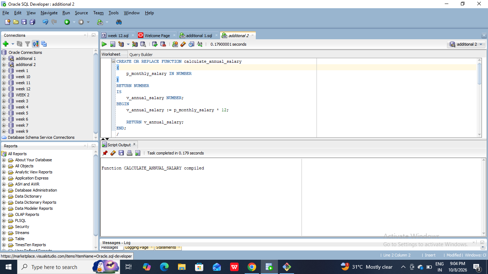
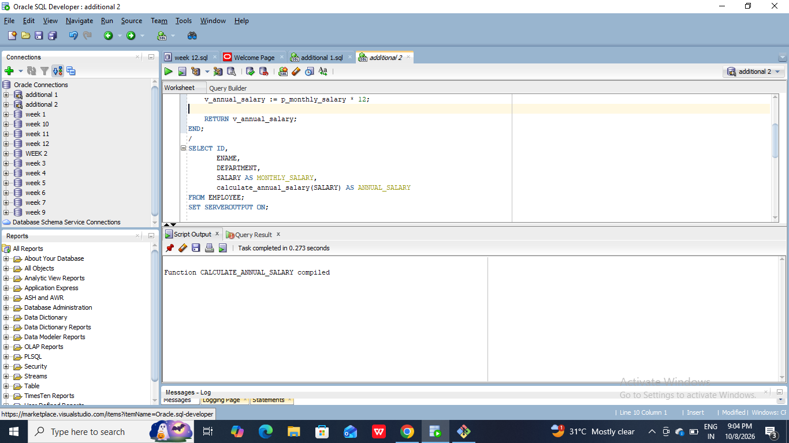
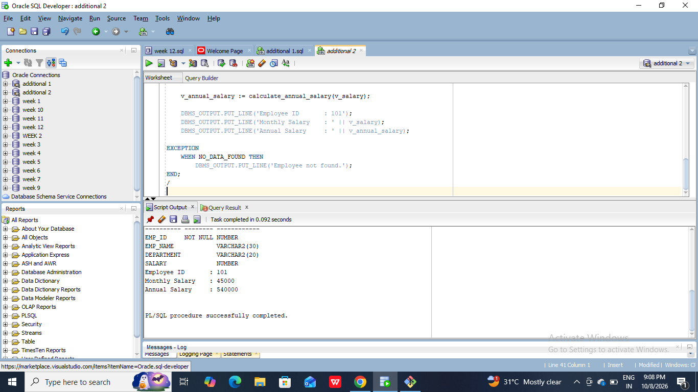

#Develop a stored function to calculate the annual salary of an employee based on the monthly salary.
```
CREATE OR REPLACE FUNCTION calculate_annual_salary
(
    p_monthly_salary IN NUMBER
)
RETURN NUMBER
IS
    v_annual_salary NUMBER;
BEGIN
    v_annual_salary := p_monthly_salary * 12;

    RETURN v_annual_salary;
END;
/
SELECT ID,
       ENAME,
       DEPARTMENT,
       SALARY AS MONTHLY_SALARY,
       calculate_annual_salary(SALARY) AS ANNUAL_SALARY
FROM EMPLOYEE;
SET SERVEROUTPUT ON;
DECLARE
    v_salary        NUMBER;
    v_annual_salary NUMBER;
BEGIN
    SELECT SALARY
    INTO v_salary
    FROM EMPLOYEE
    WHERE EMP_ID = 101;

    v_annual_salary := calculate_annual_salary(v_salary);

    DBMS_OUTPUT.PUT_LINE('Employee ID       : 101');
    DBMS_OUTPUT.PUT_LINE('Monthly Salary    : ' || v_salary);
    DBMS_OUTPUT.PUT_LINE('Annual Salary     : ' || v_annual_salary);

EXCEPTION
    WHEN NO_DATA_FOUND THEN
        DBMS_OUTPUT.PUT_LINE('Employee not found.');
END;
/
```



