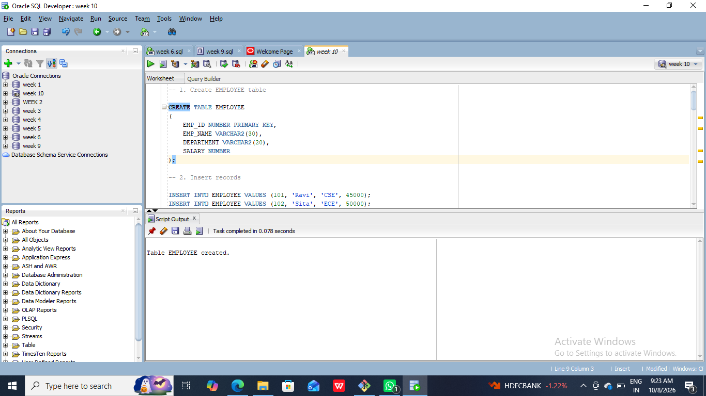
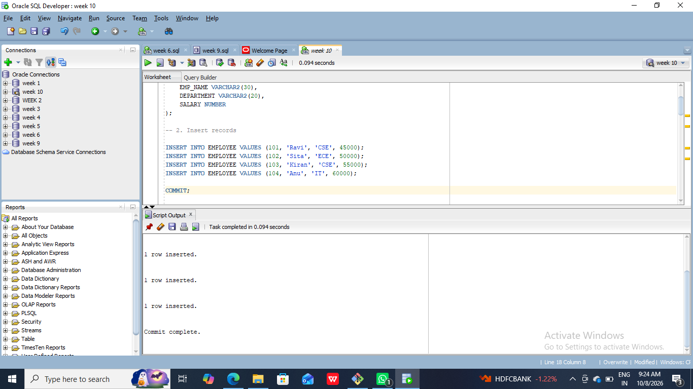
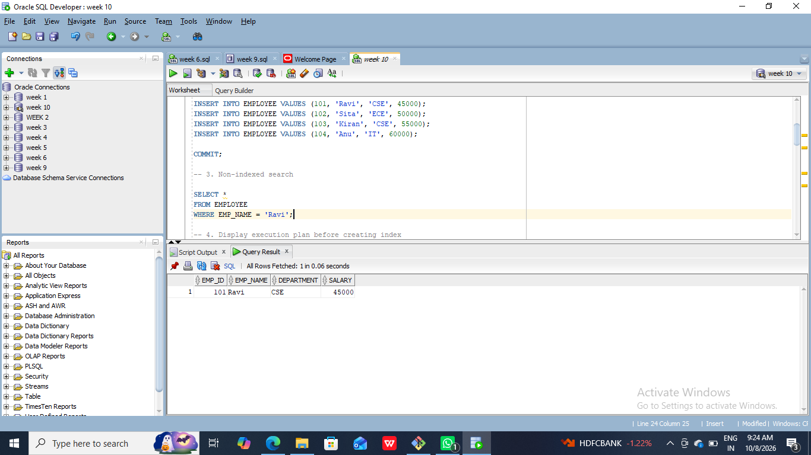
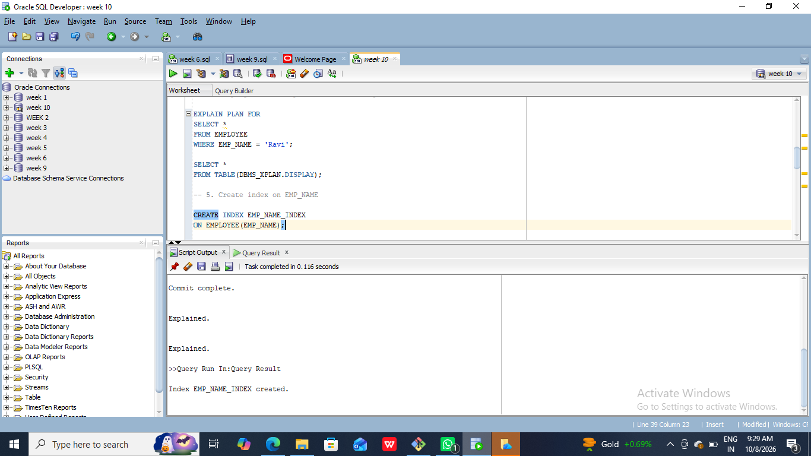
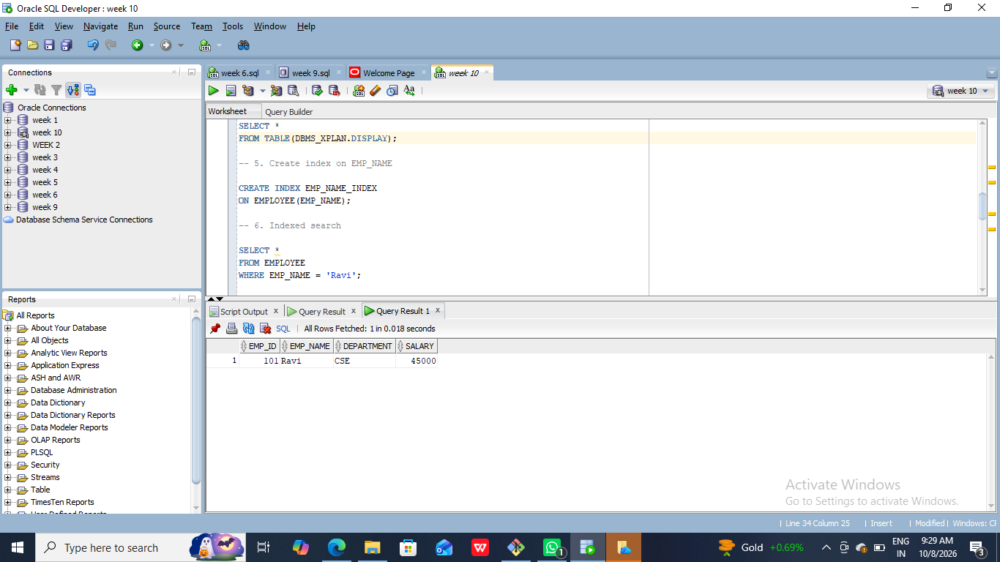
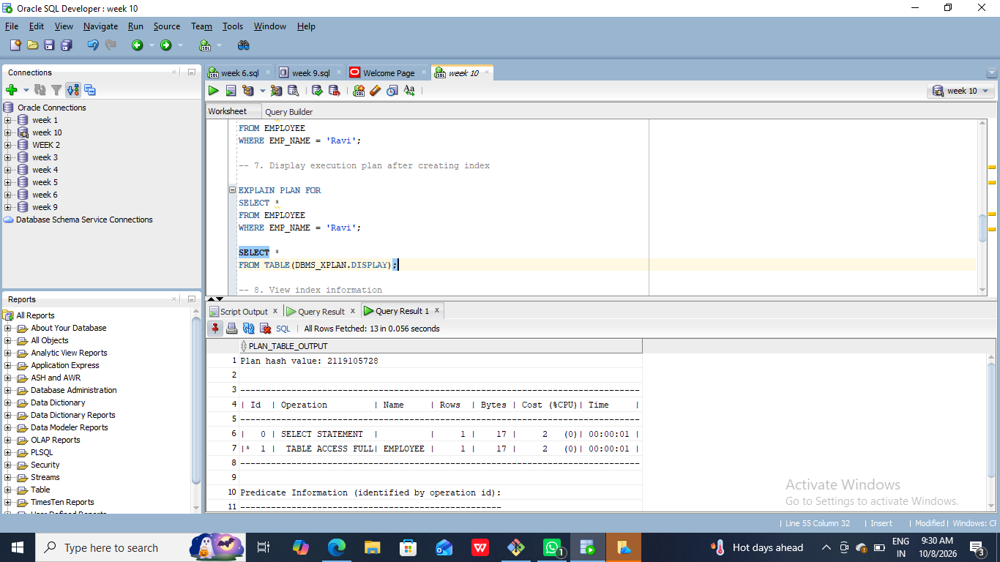
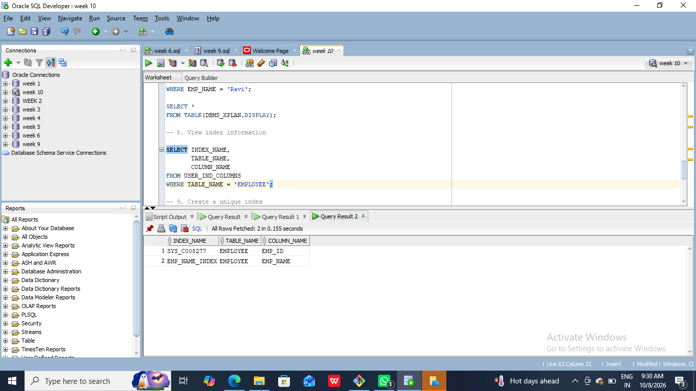
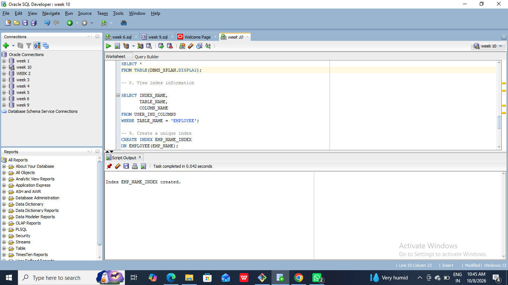
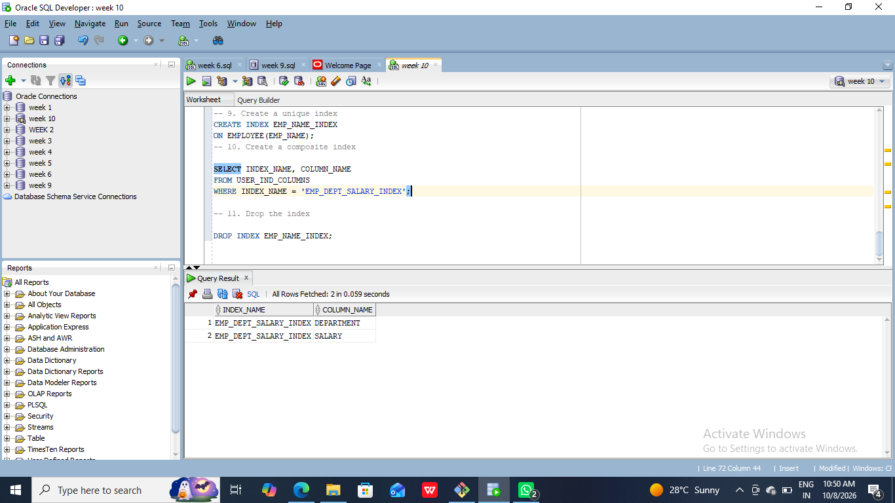

#10. Create a table and perform the search operation on table using indexing and non-indexing techniques.
#Source Code:
```
CREATE TABLE EMPLOYEE
(
    EMP_ID NUMBER PRIMARY KEY,
    EMP_NAME VARCHAR2(30),
    DEPARTMENT VARCHAR2(20),
    SALARY NUMBER
);

-- 2. Insert records

INSERT INTO EMPLOYEE VALUES (101, 'Ravi', 'CSE', 45000);
INSERT INTO EMPLOYEE VALUES (102, 'Sita', 'ECE', 50000);
INSERT INTO EMPLOYEE VALUES (103, 'Kiran', 'CSE', 55000);
INSERT INTO EMPLOYEE VALUES (104, 'Anu', 'IT', 60000);

COMMIT;

-- 3. Non-indexed search

SELECT *
FROM EMPLOYEE
WHERE EMP_NAME = 'Ravi';

-- 4. Display execution plan before creating index

EXPLAIN PLAN FOR
SELECT *
FROM EMPLOYEE
WHERE EMP_NAME = 'Ravi';

SELECT *
FROM TABLE(DBMS_XPLAN.DISPLAY);

-- 5. Create index on EMP_NAME

CREATE INDEX EMP_NAME_INDEX
ON EMPLOYEE(EMP_NAME);

-- 6. Indexed search

SELECT *
FROM EMPLOYEE
WHERE EMP_NAME = 'Ravi';

-- 7. Display execution plan after creating index

EXPLAIN PLAN FOR
SELECT *
FROM EMPLOYEE
WHERE EMP_NAME = 'Ravi';

SELECT *
FROM TABLE(DBMS_XPLAN.DISPLAY);

-- 8. View index information

SELECT INDEX_NAME,
       TABLE_NAME,
       COLUMN_NAME
FROM USER_IND_COLUMNS
WHERE TABLE_NAME = 'EMPLOYEE';

-- 9. Create a unique index
CREATE INDEX EMP_NAME_INDEX
ON EMPLOYEE(EMP_NAME);
-- 10. Create a composite index

SELECT INDEX_NAME, COLUMN_NAME
FROM USER_IND_COLUMNS
WHERE INDEX_NAME = 'EMP_DEPT_SALARY_INDEX';

--11. Drop the index

DROP INDEX EMP_NAME_INDEX;

```











