#11. A publishing company produces scientific books on various subjects. The books are written by authors who specialize in one particular subject. The company employs editors who, not necessarily being specialists in a particular area,each take sole responsibility for editing one or more publications. A publication covers essentially one of the specialist subjects and is normally written by a single author. When writing a particular book, each author works with on editor,but may submit another work for publication to be supervised by other editors.To improve their competitiveness, the company tries to employ a variety of authors, more than one author being a specialist in a particular subject for the above case study, do the following:
```
CREATE TABLE SUBJECT (
    SUBJECT_ID NUMBER(5) PRIMARY KEY,
    SUBJECT_NAME VARCHAR2(50) NOT NULL
);

CREATE TABLE AUTHOR (
    AUTHOR_ID NUMBER(5) PRIMARY KEY,
    AUTHOR_NAME VARCHAR2(50) NOT NULL,
    SUBJECT_ID NUMBER(5),
    FOREIGN KEY (SUBJECT_ID) REFERENCES SUBJECT(SUBJECT_ID)
);

CREATE TABLE EDITOR (
    EDITOR_ID NUMBER(5) PRIMARY KEY,
    EDITOR_NAME VARCHAR2(50) NOT NULL
);

CREATE TABLE PUBLICATION (
    PUBLICATION_ID NUMBER(5) PRIMARY KEY,
    TITLE VARCHAR2(100) NOT NULL,
    AUTHOR_ID NUMBER(5),
    SUBJECT_ID NUMBER(5),
    EDITOR_ID NUMBER(5),
    FOREIGN KEY (AUTHOR_ID) REFERENCES AUTHOR(AUTHOR_ID),
    FOREIGN KEY (SUBJECT_ID) REFERENCES SUBJECT(SUBJECT_ID),
    FOREIGN KEY (EDITOR_ID) REFERENCES EDITOR(EDITOR_ID)
);
INSERT INTO SUBJECT VALUES (1, 'Computer Science');
INSERT INTO SUBJECT VALUES (2, 'Physics');
INSERT INTO SUBJECT VALUES (3, 'Chemistry');

INSERT INTO AUTHOR VALUES (101, 'Arun', 1);
INSERT INTO AUTHOR VALUES (102, 'Ravi', 2);
INSERT INTO AUTHOR VALUES (103, 'Priya', 1);

INSERT INTO EDITOR VALUES (201, 'Kumar');
INSERT INTO EDITOR VALUES (202, 'Meena');
INSERT INTO EDITOR VALUES (203, 'Raj');

INSERT INTO PUBLICATION
VALUES (1001, 'DBMS Fundamentals', 101, 1, 201);

INSERT INTO PUBLICATION
VALUES (1002, 'Quantum Physics', 102, 2, 202);

INSERT INTO PUBLICATION
VALUES (1003, 'Data Structures', 103, 1, 203);

COMMIT;
SELECT * FROM SUBJECT;

SELECT * FROM AUTHOR;

SELECT * FROM EDITOR;

SELECT * FROM PUBLICATION;
SELECT
    p.PUBLICATION_ID,
    p.TITLE,
    a.AUTHOR_NAME,
    s.SUBJECT_NAME,
    e.EDITOR_NAME
FROM PUBLICATION p
JOIN AUTHOR a
    ON p.AUTHOR_ID = a.AUTHOR_ID
JOIN SUBJECT s
    ON p.SUBJECT_ID = s.SUBJECT_ID
JOIN EDITOR e
    ON p.EDITOR_ID = e.EDITOR_ID;
```
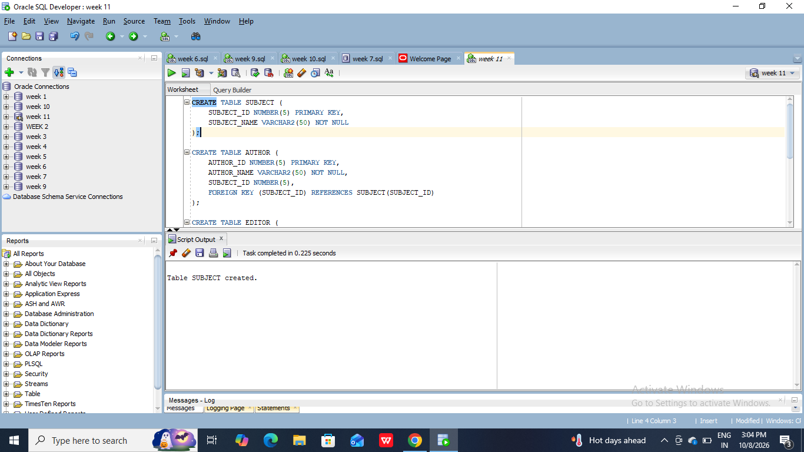
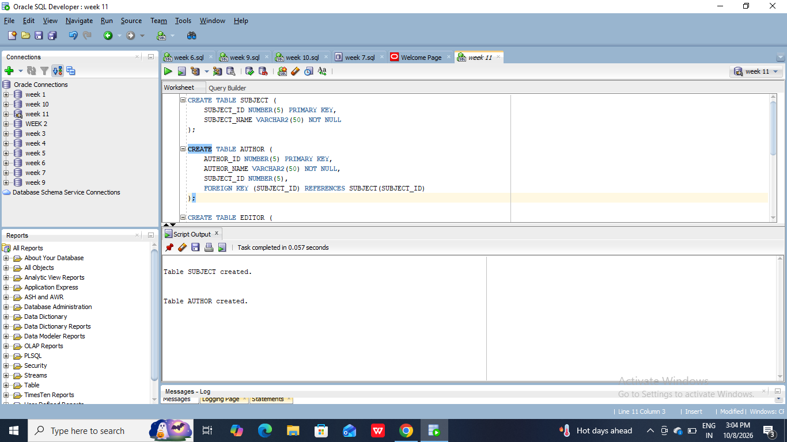
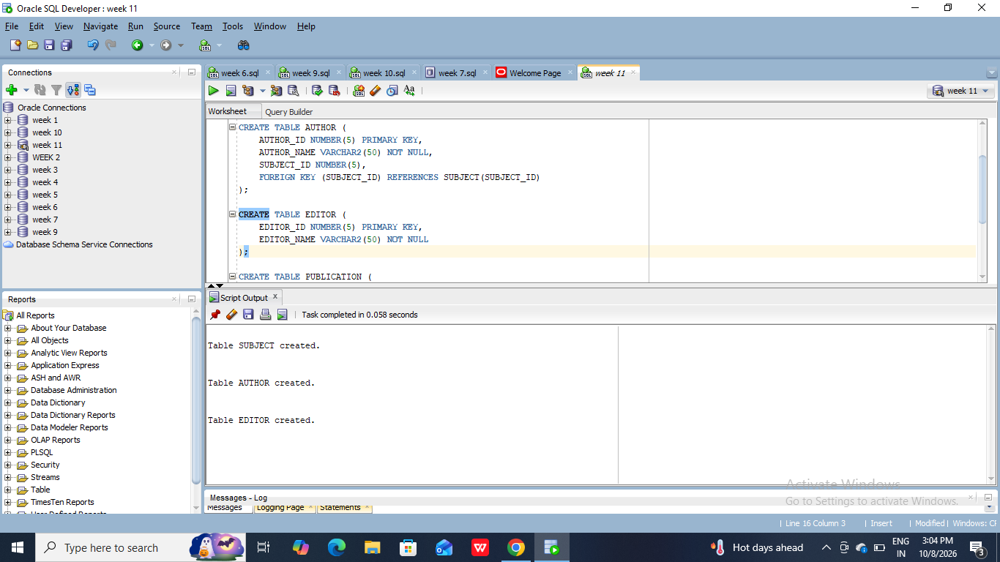
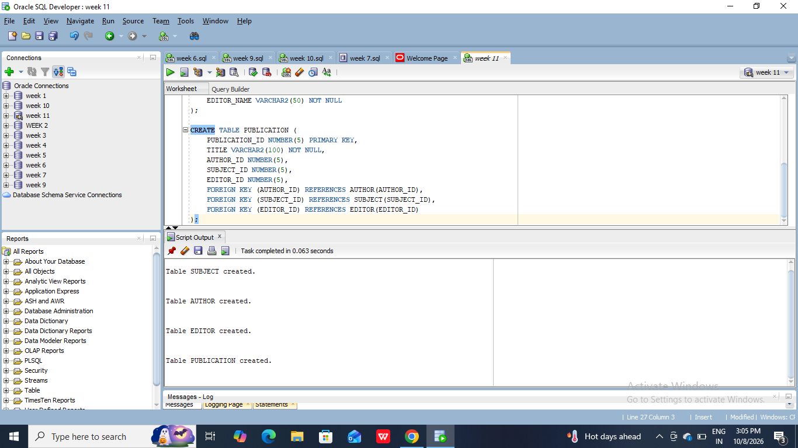
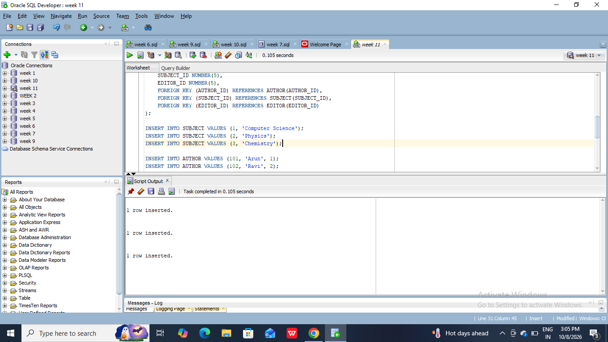
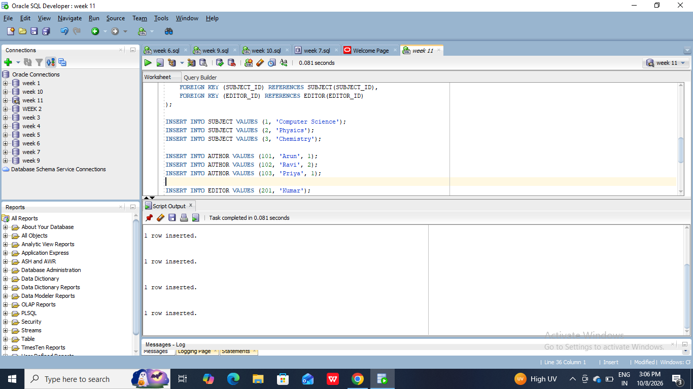
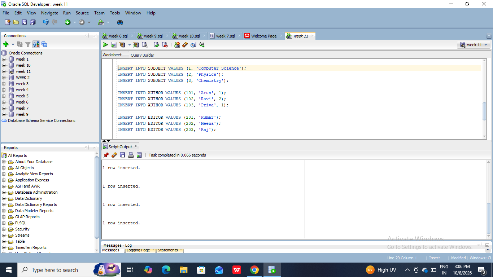
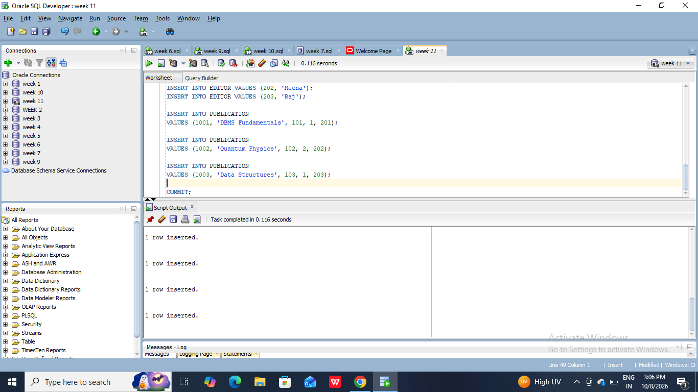

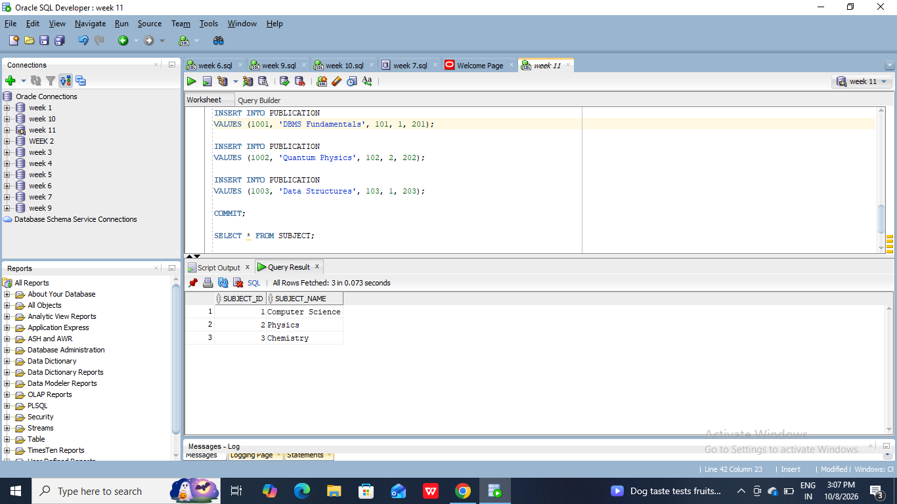
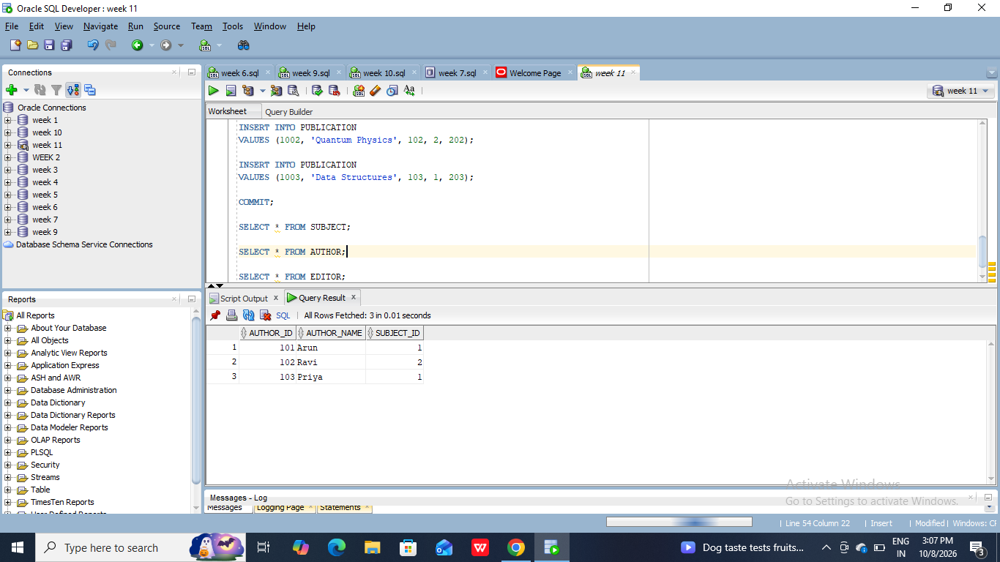
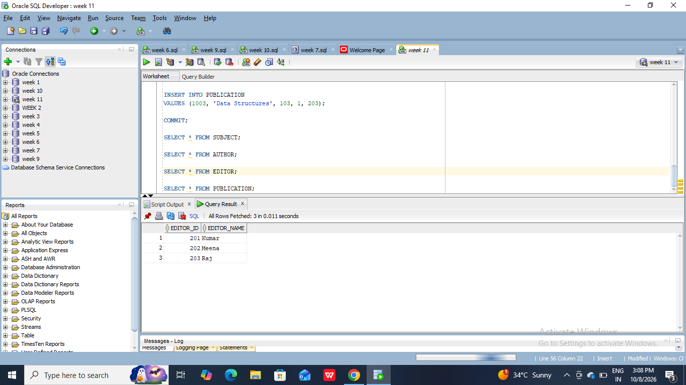
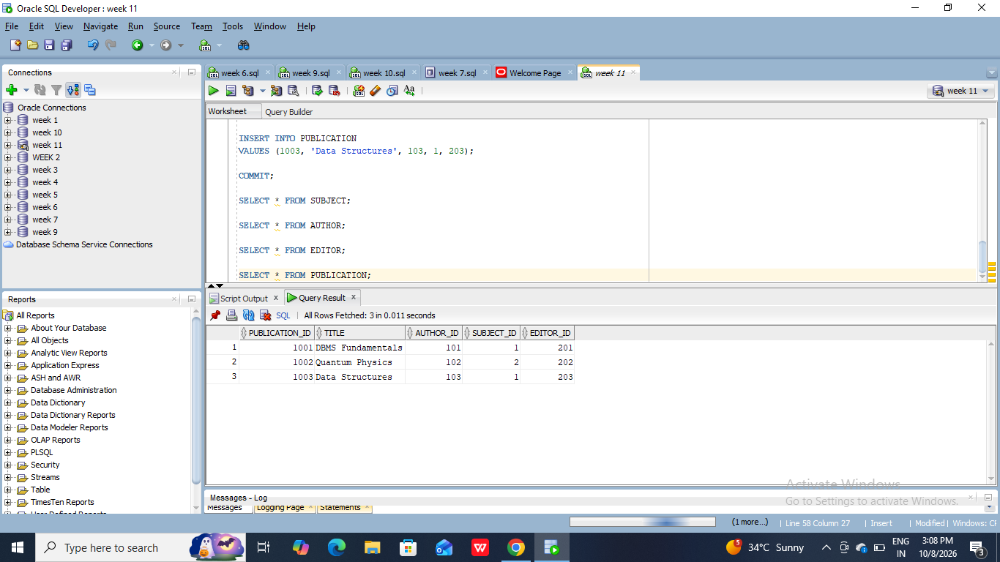
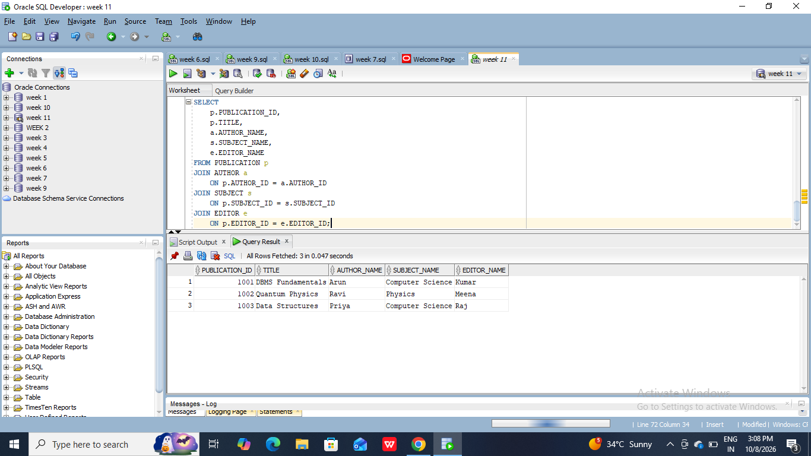
