##3(a).Queries using Conversion functions (to_char, to_number and to_date)
```
CREATE TABLE EMPLOYEE (
    EMPLOYEE_ID NUMBER(5) PRIMARY KEY,
    FIRST_NAME VARCHAR2(20),
    LAST_NAME VARCHAR2(20),
    GENDER CHAR(1),
    JOB_ID VARCHAR2(15),
    DEPARTMENT VARCHAR2(30),
    SALARY NUMBER(8,2),
    COMMISSION NUMBER(5,2),
    HIRE_DATE DATE,
    CITY VARCHAR2(20)
);

INSERT INTO EMPLOYEE VALUES
(101, 'John', 'Smith', 'M', 'IT_PROG', 'IT',
 65000, 5, TO_DATE('15-JAN-2020','DD-MON-YYYY'), 'Hyderabad');

INSERT INTO EMPLOYEE VALUES
(102, 'Anita', 'Sharma', 'F', 'HR_REP', 'HR',
 52000, 3, TO_DATE('10-JUN-2019','DD-MON-YYYY'), 'Bengaluru');

INSERT INTO EMPLOYEE VALUES
(103, 'Rahul', 'Kumar', 'M', 'SA_REP', 'Sales',
 48000, 8, TO_DATE('25-AUG-2021','DD-MON-YYYY'), 'Chennai');

INSERT INTO EMPLOYEE VALUES
(104, 'Priya', 'Reddy', 'F', 'MK_MAN', 'Marketing',
 72000, 10, TO_DATE('05-MAR-2018','DD-MON-YYYY'), 'Hyderabad');

INSERT INTO EMPLOYEE VALUES
(105, 'David', 'Wilson', 'M', 'FI_ACCOUNT', 'Finance',
 58000, NULL, TO_DATE('18-DEC-2017','DD-MON-YYYY'), 'Mumbai');

INSERT INTO EMPLOYEE VALUES
(106, 'Sneha', 'Patel', 'F', 'IT_PROG', 'IT',
 69000, 6, TO_DATE('12-NOV-2022','DD-MON-YYYY'), 'Pune');

INSERT INTO EMPLOYEE VALUES
(107, 'Amit', 'Verma', 'M', 'SA_REP', 'Sales',
 45000, 4, TO_DATE('20-JUL-2023','DD-MON-YYYY'), 'Delhi');

INSERT INTO EMPLOYEE VALUES
(108, 'Kiran', 'Rao', 'M', 'HR_REP', 'HR',
 50000, NULL, TO_DATE('09-FEB-2021','DD-MON-YYYY'), 'Hyderabad');
 
 COMMIT;
 
 SELECT * FROM EMPLOYEE;
```
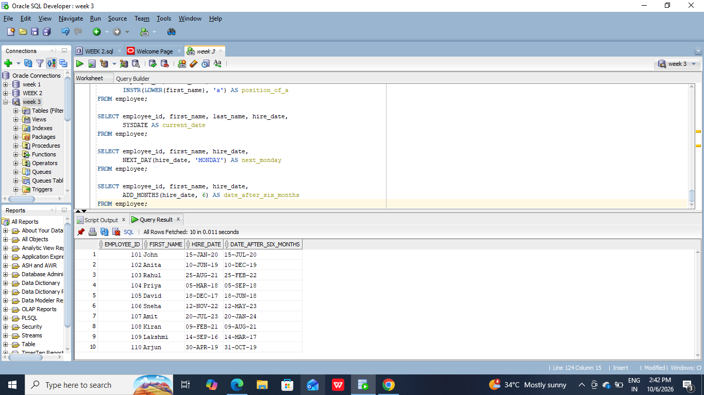

#Q1. Write an SQL query to display the employee ID, first name, and hire date in the format DD-MON-YYYY using the TO_CHAR function.
```
SELECT employee_id, first_name,
       TO_CHAR(hire_date, 'DD-MON-YYYY') AS hire_date
FROM employee;
```
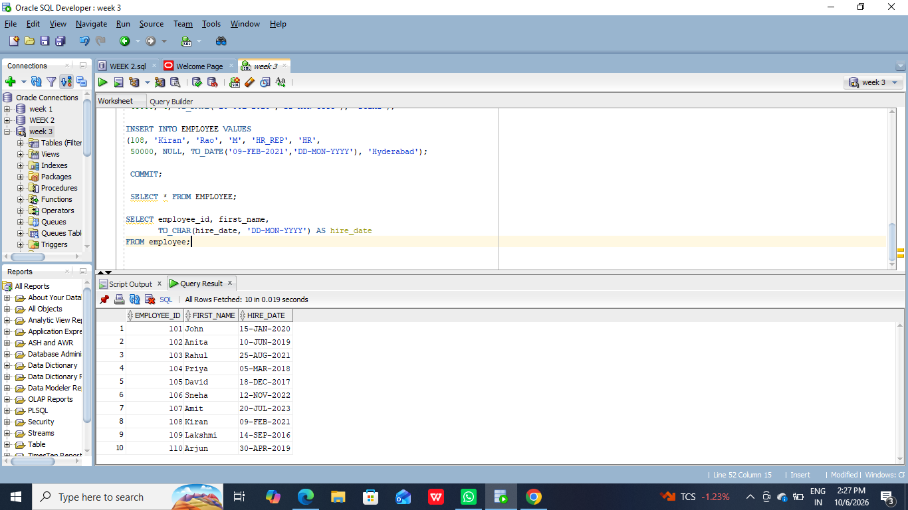

#Q2. Write an SQL query to display the employee ID, first name, and salary formatted with a currency symbol using the TO_CHAR function.
```
SELECT employee_id, first_name,
       TO_CHAR(salary, 'L99,999,999.00') AS salary
FROM employee;
```
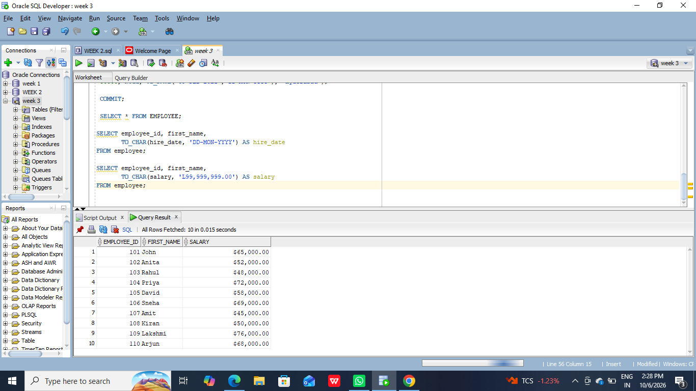

#Q3. Write an SQL query to add 5000 to each employee's salary using the TO_NUMBER function.
```
SELECT employee_id, first_name,
       TO_NUMBER(salary) + 5000 AS new_salary
FROM employee;
```
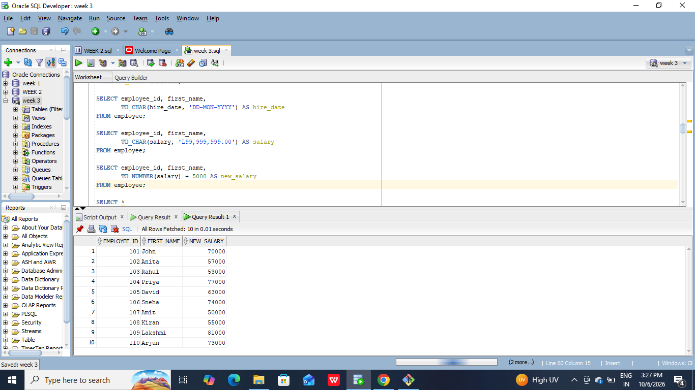

#Q4. Write an SQL query to display the details of employees who were hired after 01-JAN-2020 using the TO_DATE function.
```
SELECT *
FROM employee
WHERE hire_date > TO_DATE('01-JAN-2020', 'DD-MON-YYYY');
```
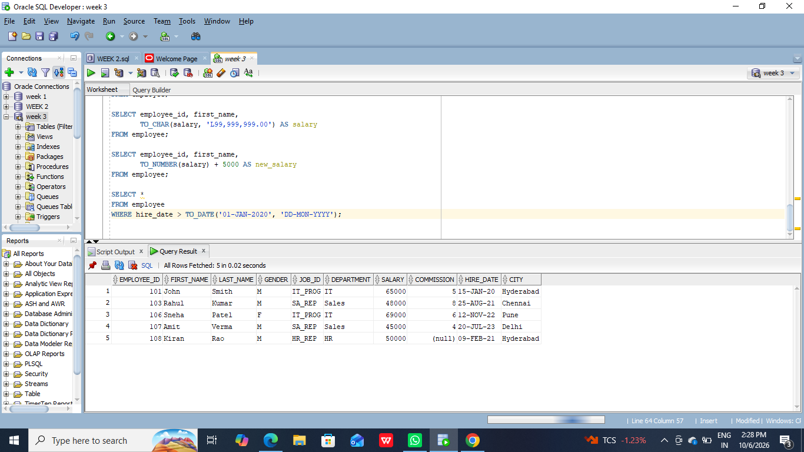

#Q5. Write an SQL query to display the full name of each employee by concatenating the first name and last name using the concatenation (||) operator.
```
SELECT employee_id,
       first_name || ' ' || last_name AS full_name
FROM employee; 
```
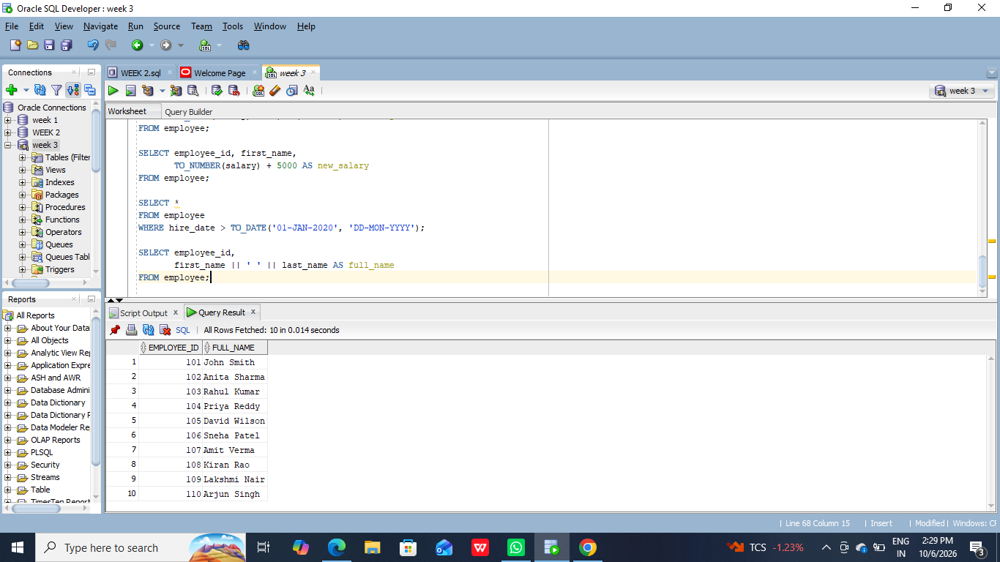

#Q6. Write an SQL query to concatenate the first name and last name of each employee using the CONCAT function.
```
SELECT employee_id,
       CONCAT(first_name, CONCAT(' ', last_name)) AS full_name
FROM employee;
```
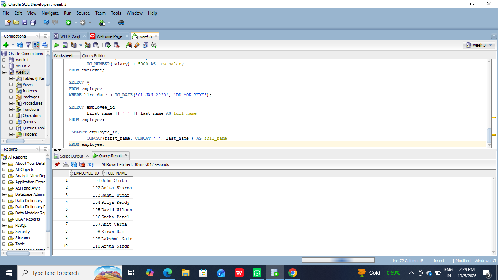

#Q7. Write an SQL query to display each employee's first name left-padded with * characters using the LPAD function.
```
SELECT first_name,
       LPAD(first_name, 15, '*') AS padded_name
FROM employee;
```
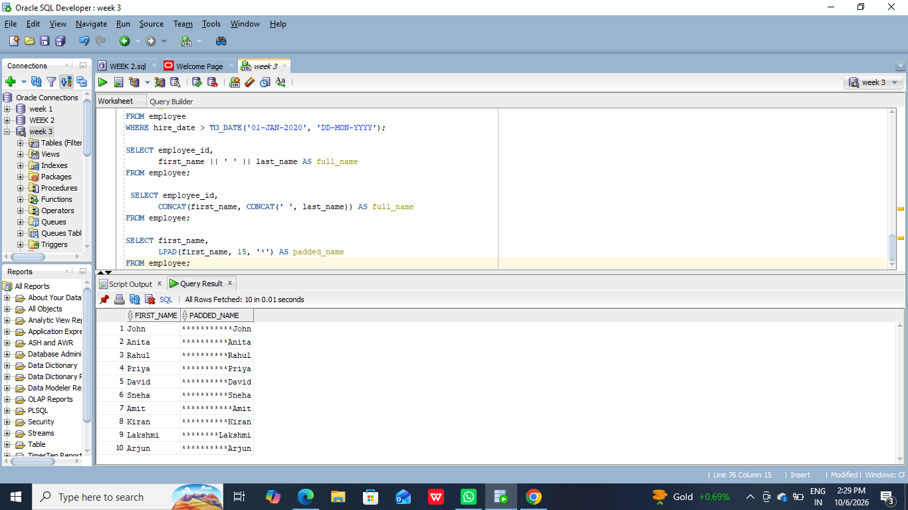

#Q8. Write an SQL query to display each employee's first name right-padded with * characters using the RPAD function.
```
SELECT first_name,
       RPAD(first_name, 15, '*') AS padded_name
FROM employee;
```
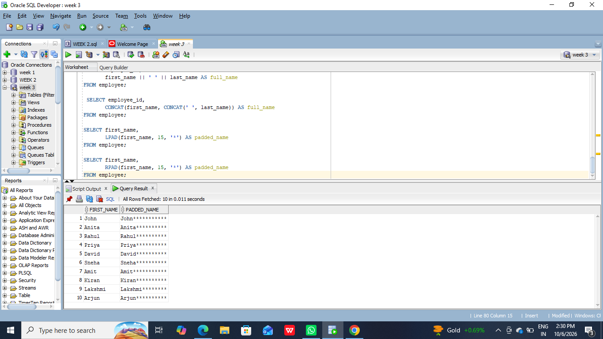
#Q9. Write an SQL query to remove leading spaces from employee names using the LTRIM function.
```
SELECT first_name,
       LTRIM(first_name) AS trimmed_name
FROM employee;
```
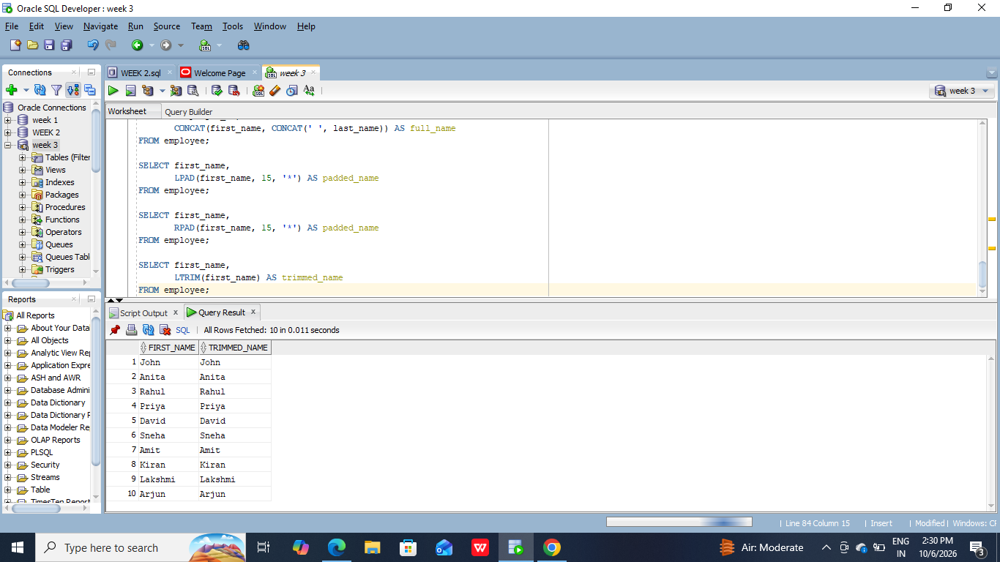
#Q10. Write an SQL query to remove trailing spaces from employee names using the RTRIM function.
```
SELECT last_name,
       RTRIM(last_name) AS trimmed_name
FROM employee;
```


#Q11. Write an SQL query to display all employee first names in lowercase using the LOWER function.
```
SELECT employee_id,
       LOWER(first_name) AS first_name
FROM employee;
```

#Q12. Write an SQL query to display all employee first names in uppercase using the UPPER function.
```
SELECT employee_id,
       UPPER(first_name) AS first_name
FROM employee;
```
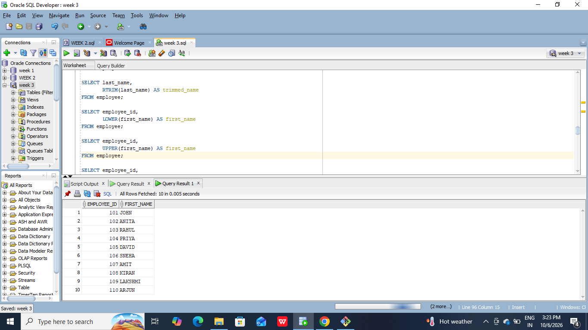
#Q13. Write an SQL query to display employee first names in proper case using the INITCAP function.
```
SELECT employee_id,
       INITCAP(first_name) AS first_name
FROM employee;
```
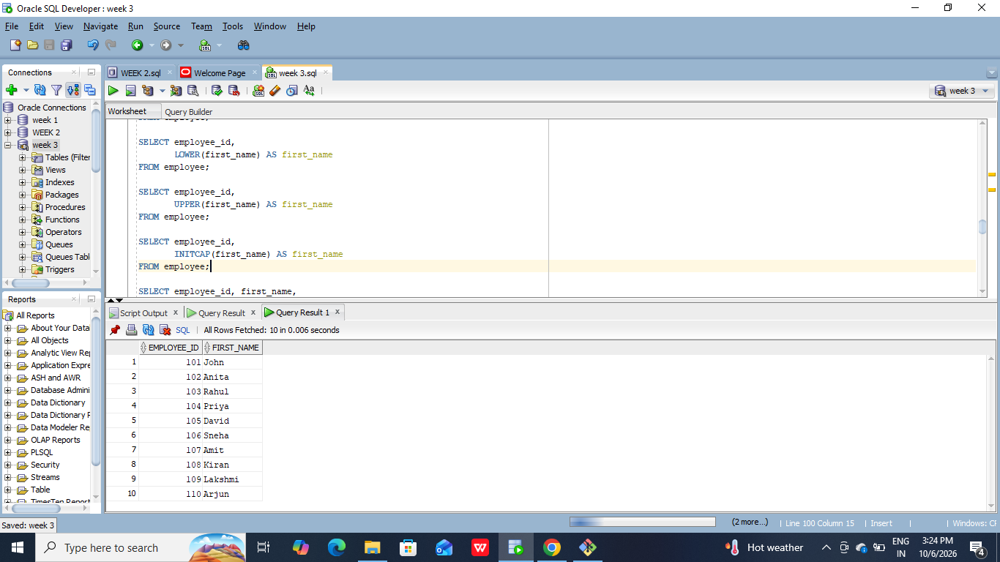
#Q14. Write an SQL query to display the length of each employee's first name using the LENGTH function.
```
SELECT employee_id, first_name,
       LENGTH(first_name) AS name_length
FROM employee;
```

#Q15. Write an SQL query to display the first three characters of each employee's first name using the SUBSTR function.
```
SELECT employee_id, first_name,
       SUBSTR(first_name, 1, 3) AS first_three_chars
FROM employee;
```
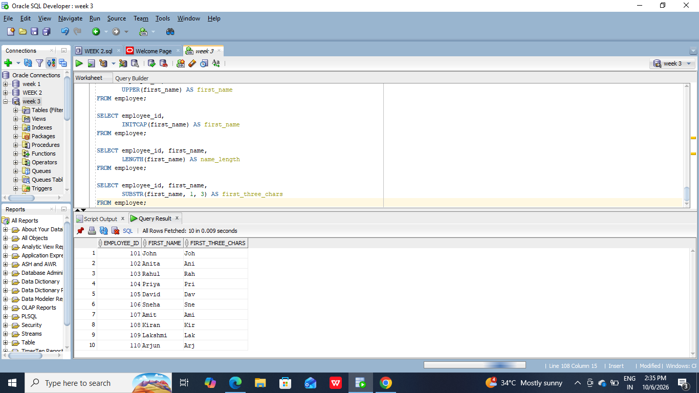
#Q16. Write an SQL query to find the position of the character 'a' in each employee's first name using the INSTR function.
```
SELECT employee_id, first_name,
       INSTR(LOWER(first_name), 'a') AS position_of_a
FROM employee;
```
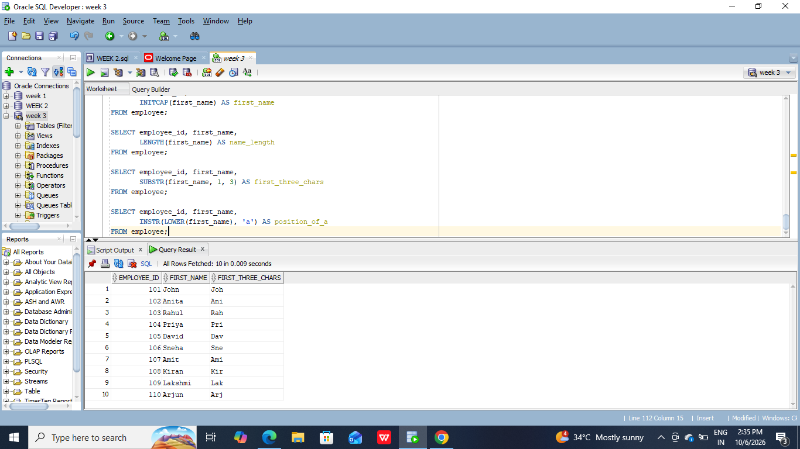
#Q17. Write an SQL query to display the current system date along with each employee's details using the SYSDATE function.
```
SELECT employee_id, first_name, last_name, hire_date,
       SYSDATE AS current_date
FROM employee;
```
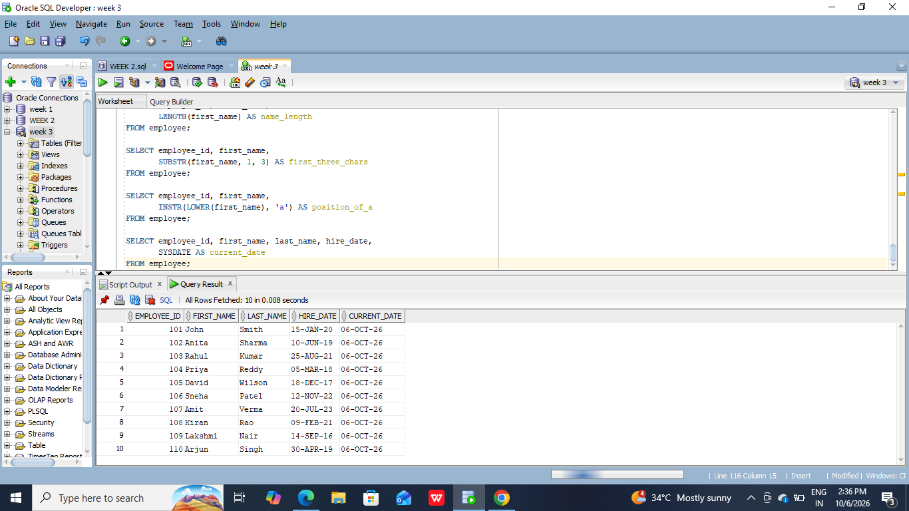
#Q18. Write an SQL query to display the next Monday after each employee's hire date using the NEXT_DAY function.
```
SELECT employee_id, first_name, hire_date,
       NEXT_DAY(hire_date, 'MONDAY') AS next_monday
FROM employee;
````
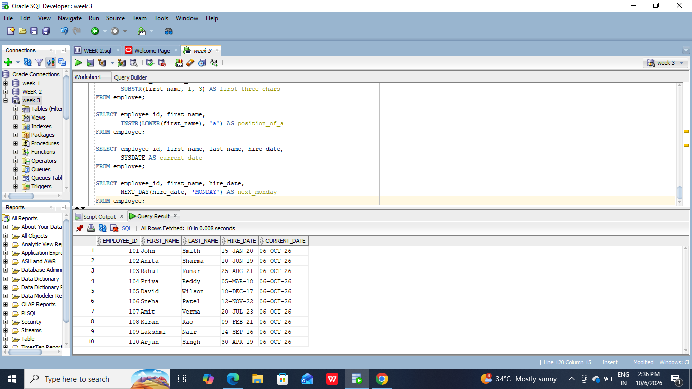
#Q19. Write an SQL query to display the date obtained by adding six months to each employee's hire date using the ADD_MONTHS function.
```
SELECT employee_id, first_name, hire_date,
       ADD_MONTHS(hire_date, 6) AS date_after_six_months
FROM employee;
```
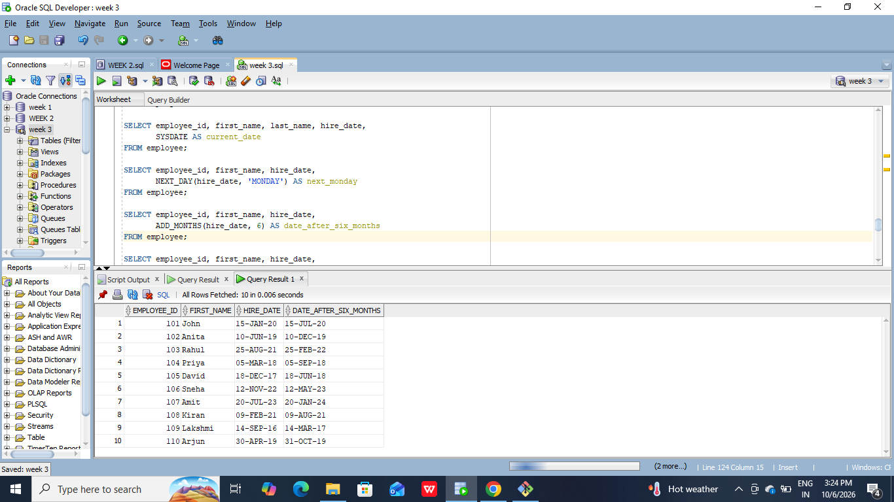
#Q20. Write an SQL query to display the last day of the month for each employee's hire date using the LAST_DAY function.
```
SELECT employee_id, first_name, hire_date,
       LAST_DAY(hire_date) AS last_day_of_month
FROM employee;
```
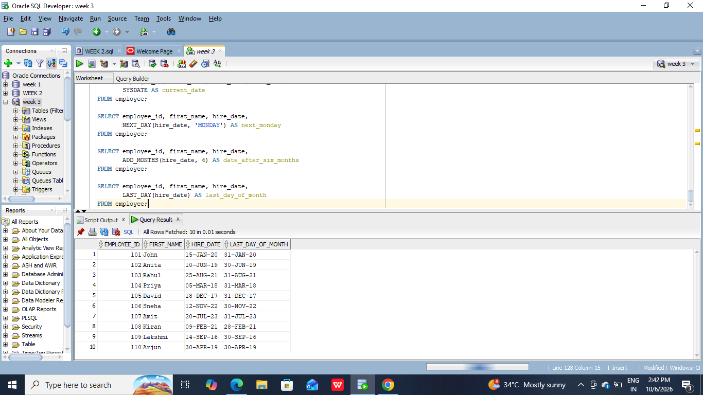
#Q21. Write an SQL query to calculate the total number of months each employee has worked using the MONTHS_BETWEEN function.
```
SELECT employee_id, first_name, hire_date,
       MONTHS_BETWEEN(SYSDATE, hire_date) AS months_worked
FROM employee;
```
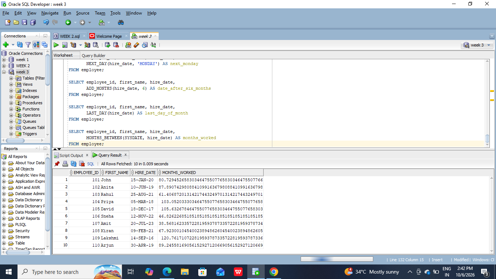
#Q22. Write an SQL query to display the smaller value between each employee's salary and 60000 using the LEAST function.
```
SELECT employee_id, first_name, salary,
       LEAST(salary, 60000) AS smaller_value
FROM employee;
```

#Q23. Write an SQL query to display the greater value between each employee's salary and 60000 using the GREATEST function.
```
SELECT employee_id, first_name, salary,
       GREATEST(salary, 60000) AS greater_value
FROM employee;
```
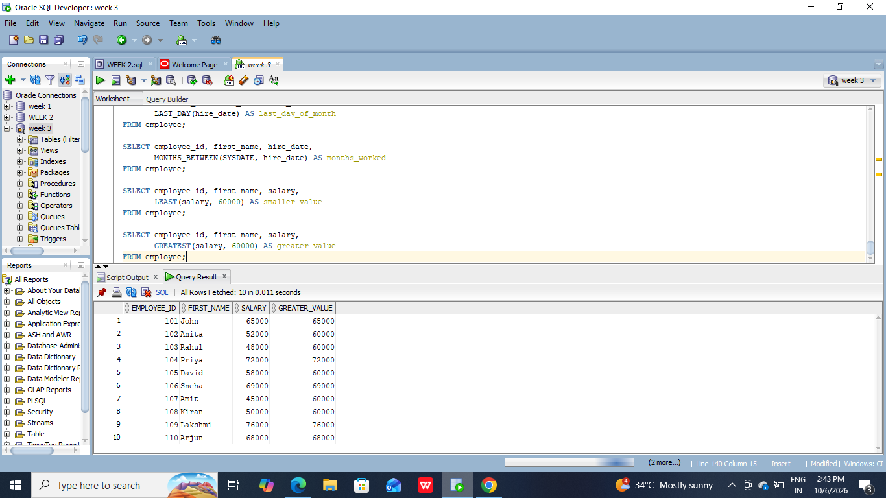
#Q24. Write an SQL query to display the first day of the month of each employee's hire date using the TRUNC function.
```
SELECT employee_id, first_name, hire_date,
       TRUNC(hire_date, 'MONTH') AS first_day_of_month
FROM employee;
```
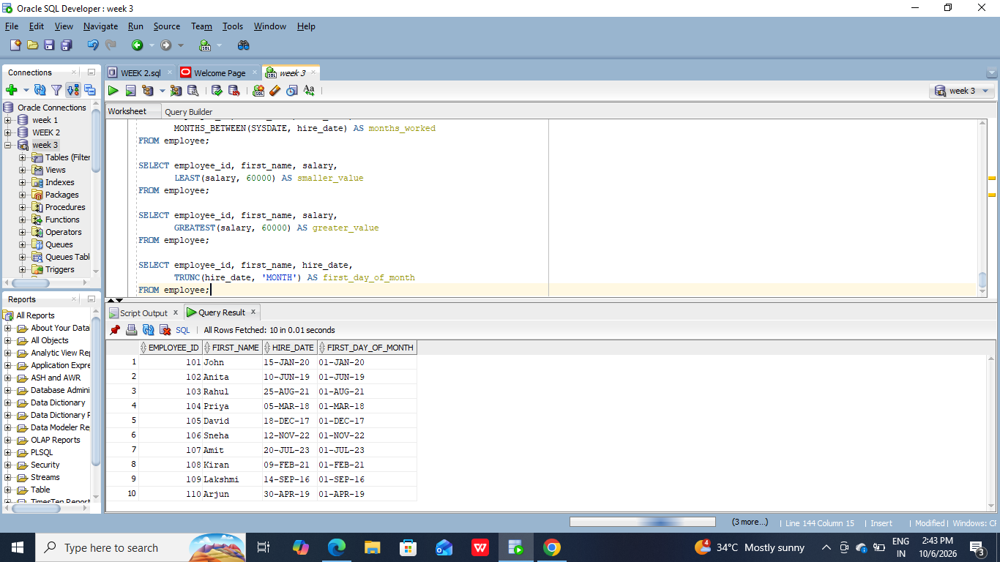
#Q25. Write an SQL query to round each employee's hire date to the nearest month using the ROUND function.
```
SELECT employee_id, first_name, hire_date,
       ROUND(hire_date, 'MONTH') AS rounded_month
FROM employee;
```
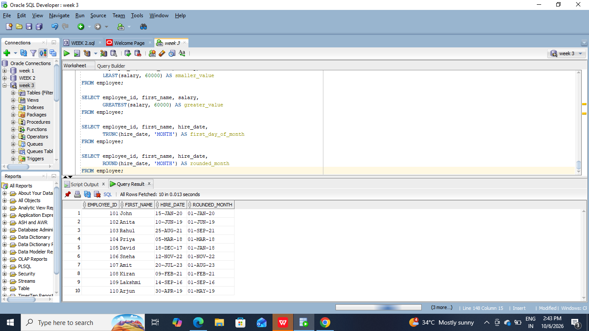
#Q26. Write an SQL query to display each employee's hire date in the format DAY, DD-MON-YYYY using the TO_CHAR function.
```
SELECT employee_id, first_name,
       TO_CHAR(hire_date, 'DAY, DD-MON-YYYY') AS formatted_hire_date
FROM employee;
```
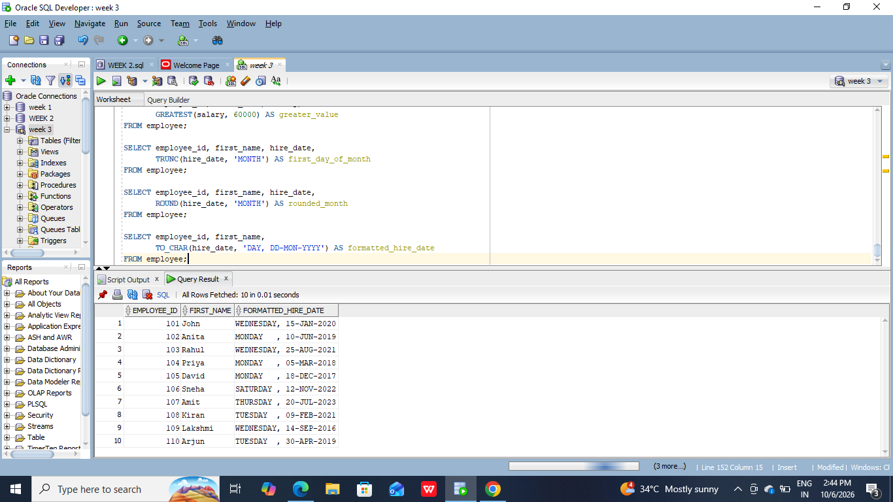
#Q27. Write an SQL query to display the details of employees who were hired before 01-JAN-2019 using the TO_DATE function.
```
SELECT*
FROM employee
WHERE hire_date < TO_DATE('01-JAN-2019', 'DD-MON-YYYY');
```
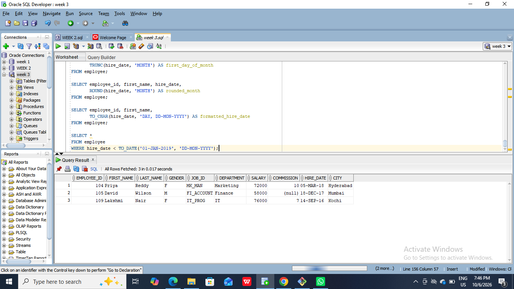

##3(b).Queries Using Creation and Dropping of Views
#Q1.Write an SQL query to create a view named EMP_VIEW that displays all columns from the EMPLOYEES table.
```
CREATE VIEW EMP_VIEW AS
SELECT *
FROM EMPLOYEE;
```
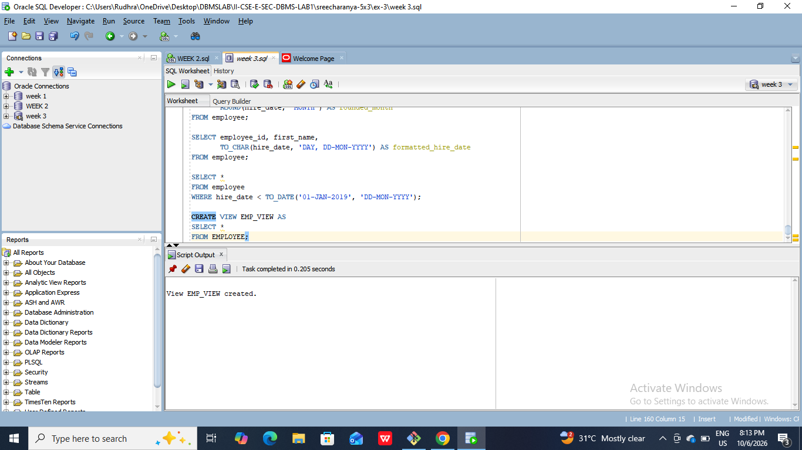

#Q2. Write an SQL query to create a view named EMP_BASIC that displays the Employee ID, First Name, Last Name, Department, and Salary.
```
CREATE VIEW EMP_BASIC AS
SELECT EMPLOYEE_ID, FIRST_NAME, LAST_NAME, DEPARTMENT, SALARY
FROM EMPLOYEE;
```
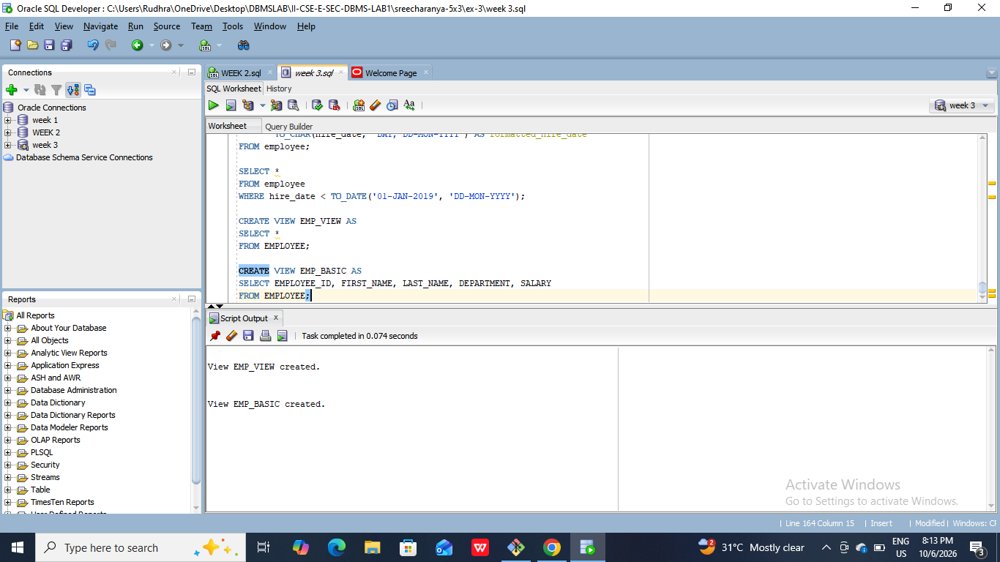
#Q3.Write an SQL query to display all records from the EMP_VIEW.
```
SELECT *
FROM EMP_VIEW;
```
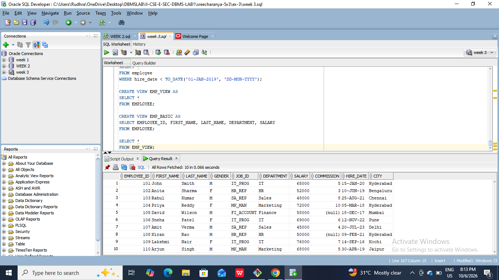
#Q4.Write an SQL query to create a view named IT_EMPLOYEES that displays the details of employees working in the IT department.
```
CREATE VIEW IT_EMPLOYEES AS
SELECT *
FROM EMPLOYEE
WHERE DEPARTMENT = 'IT';
```
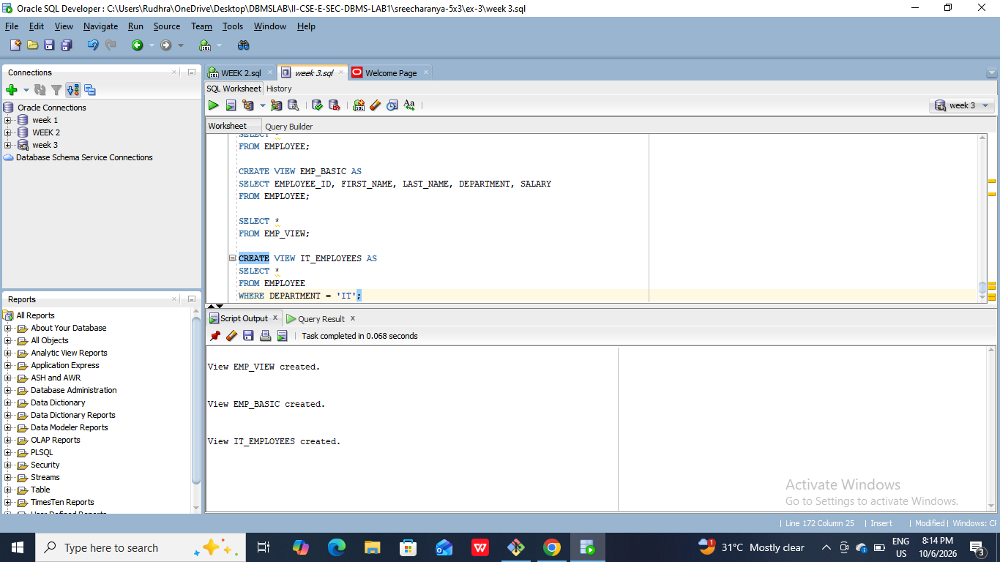
#Q5. Write an SQL query to create a view named HIGH_SALARY that displays employees whose salary is greater than ₹60,000.
```
CREATE VIEW HIGH_SALARY AS
SELECT *
FROM EMPLOYEE
WHERE SALARY > 60000;
```
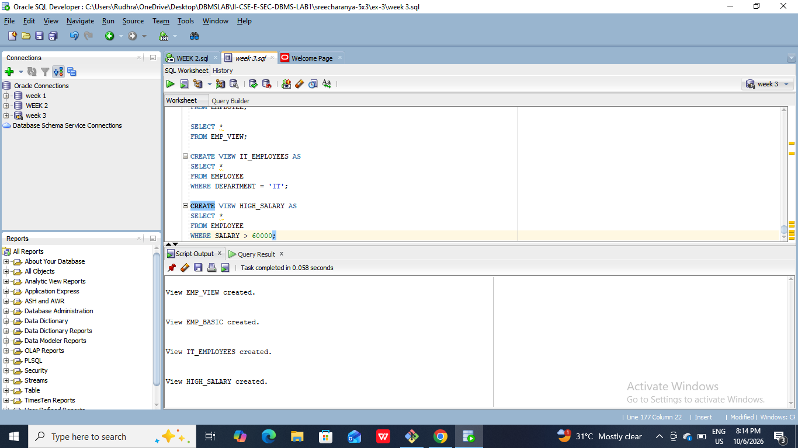
#Q6.Write an SQL query to create a view named HYDERABAD_EMP that displays employees whose city is Hyderabad.
```
CREATE VIEW HYDERABAD_EMP AS
SELECT *
FROM EMPLOYEE
WHERE CITY = 'Hyderabad';
```
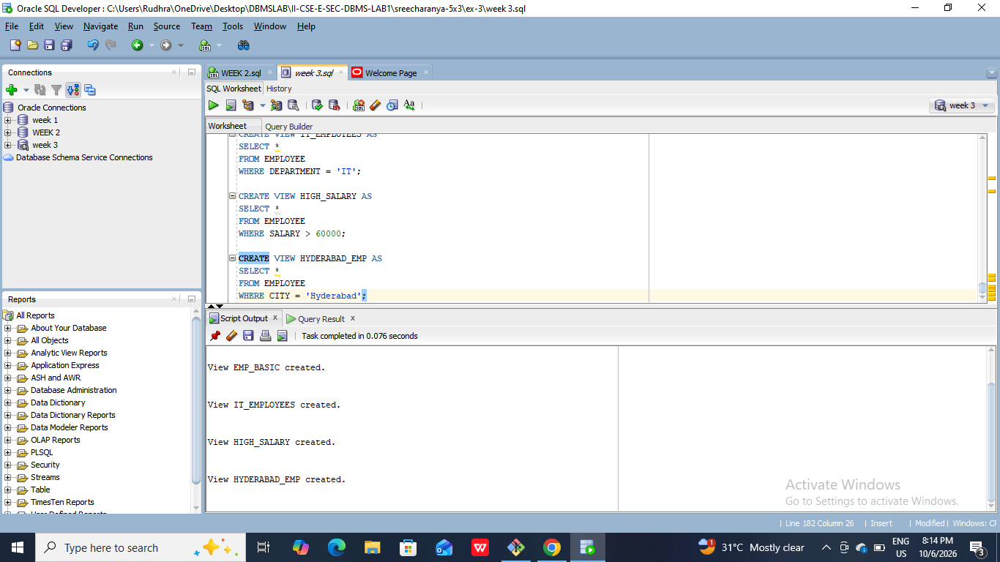
#Q7.Write an SQL query to create a view named FEMALE_EMP that displays the details of all female employees.
```
CREATE VIEW FEMALE_EMP AS
SELECT *
FROM EMPLOYEE
WHERE GENDER = 'Female';
```
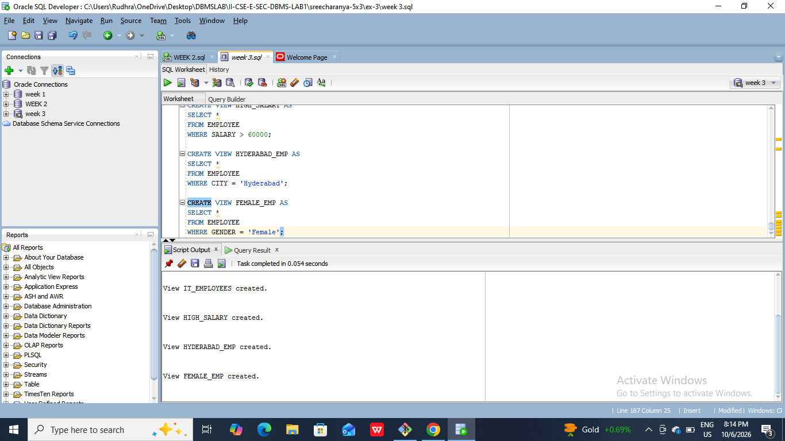
#Q8.Write an SQL query to create a view named RECENT_EMPLOYEES that displays employees hired on or after 01-JAN-2020.
```
CREATE VIEW RECENT_EMPLOYEES AS
SELECT *
FROM EMPLOYEE
WHERE HIRE_DATE >= TO_DATE('01-JAN-2020', 'DD-MON-YYYY');
```

#Q9.Write an SQL query to display the Employee ID, First Name, and Salary from the HIGH_SALARY view.
```
SELECT EMPLOYEE_ID, FIRST_NAME, SALARY
FROM HIGH_SALARY;
```
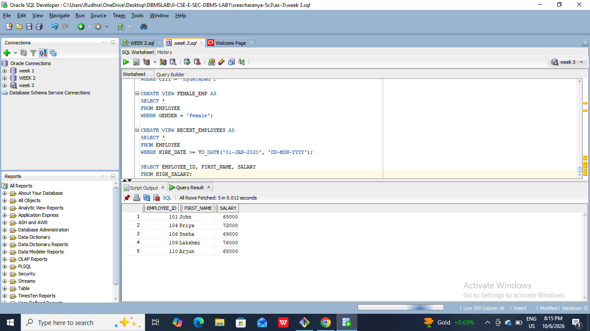
#Q10.Write an SQL query to replace the EMP_BASIC view by adding the CITY column using the CREATE OR REPLACE VIEW statement.
```
CREATE OR REPLACE VIEW EMP_BASIC AS
SELECT EMPLOYEE_ID, FIRST_NAME, LAST_NAME, DEPARTMENT, SALARY, CITY
FROM EMPLOYEE;
```
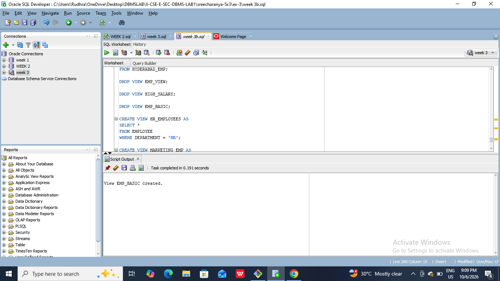
#Q11.Write an SQL query to create a read-only view named EMP_SALARY_VIEW that displays the Employee ID, First Name, Last Name, and Salary.
```
CREATE VIEW EMP_SALARY_VIEW AS
SELECT EMPLOYEE_ID, FIRST_NAME, LAST_NAME, SALARY
FROM EMPLOYEE
WITH READ ONLY;
```
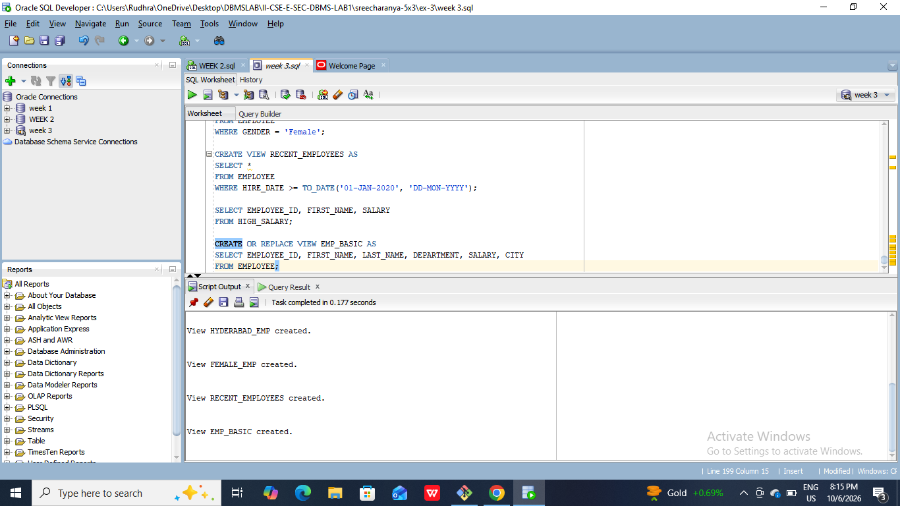
#Q12.Write an SQL query to create a view named SALES_EMP that displays employees belonging to the Sales department using the WITH CHECK OPTION clause.
```
CREATE VIEW SALES_EMP AS
SELECT *
FROM EMPLOYEE
WHERE DEPARTMENT = 'Sales'
WITH CHECK OPTION;
```
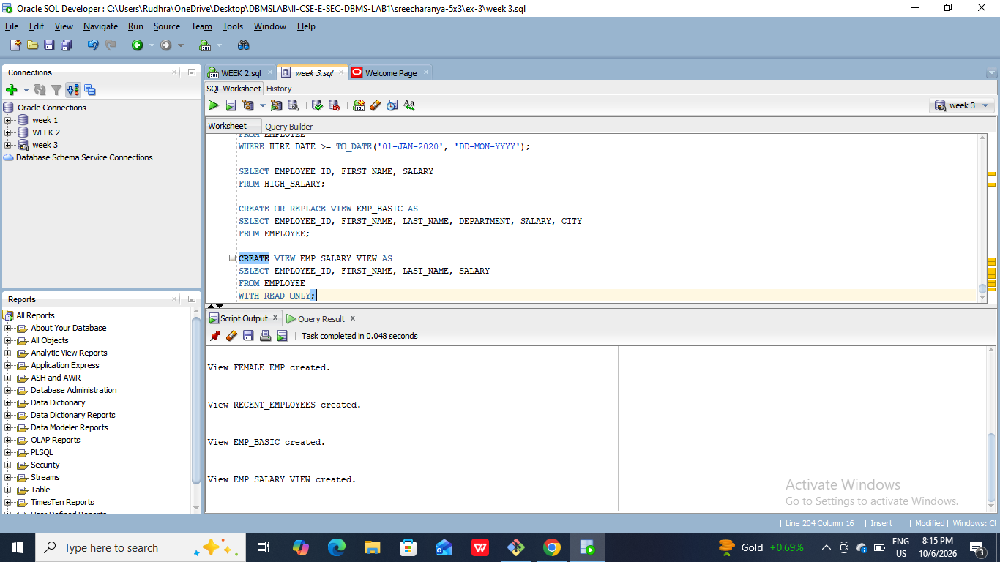
#Q13.Write an SQL query to update the salary of employee 101 through the EMP_BASIC view.
```
UPDATE EMP_BASIC
SET SALARY = 75000
WHERE EMPLOYEE_ID = 101;
```
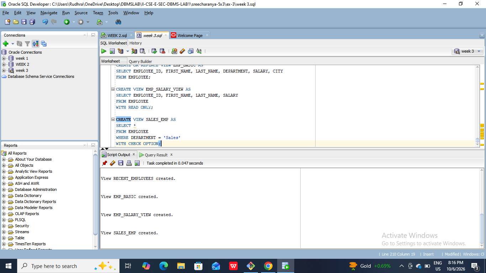
#Q14.Write an SQL query to delete the details of employee 107 through the EMP_VIEW.
```
DELETE FROM EMP_VIEW
WHERE EMPLOYEE_ID = 107;
```
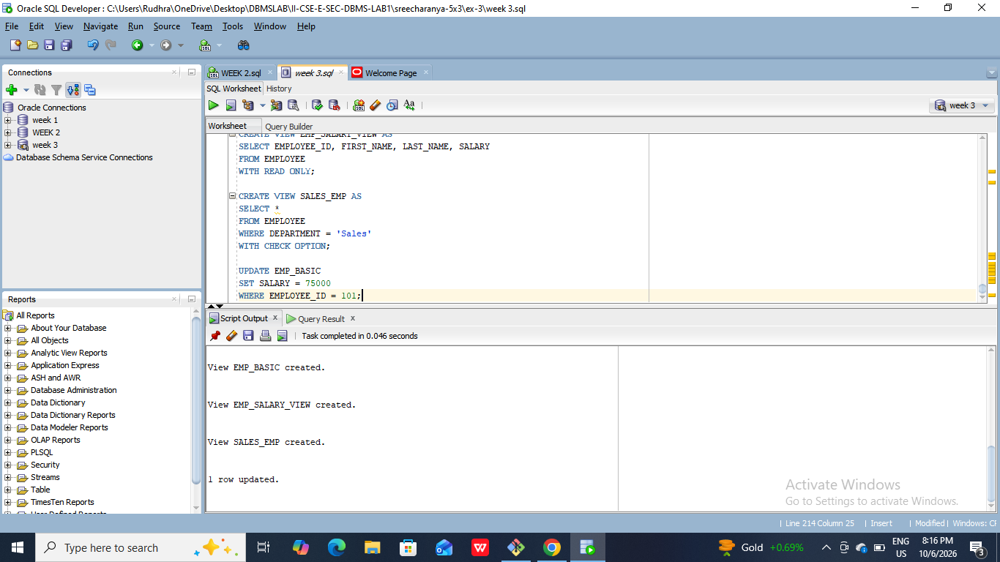
#Q15.Write an SQL query to insert a new employee into the EMP_BASIC view.
```
INSERT INTO EMP_BASIC
(EMPLOYEE_ID, FIRST_NAME, LAST_NAME, DEPARTMENT, SALARY, CITY)
VALUES
(111, 'Ravi', 'Kumar', 'IT', 55000, 'Hyderabad');
```
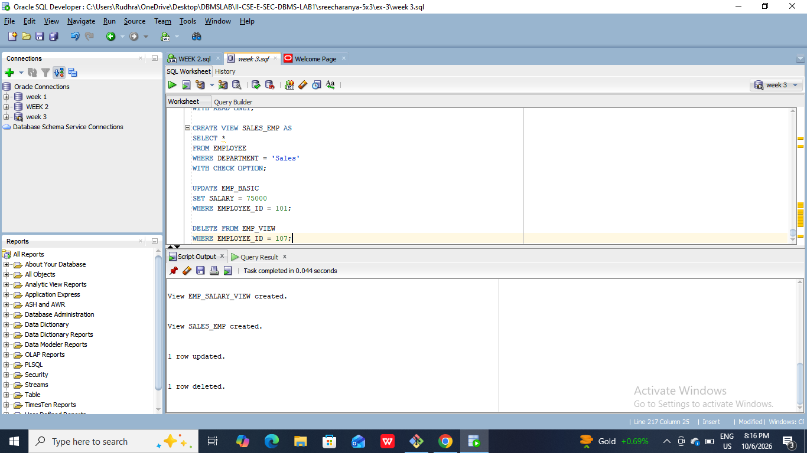
#Q16.Write an SQL query to display the structure of the EMP_BASIC view.
```
DESC EMP_BASIC;
```
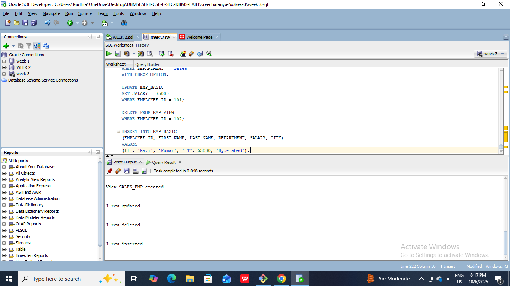
#Q17.Write an SQL query to display all records from the IT_EMPLOYEES view.
```
SELECT *
FROM IT_EMPLOYEES;
```
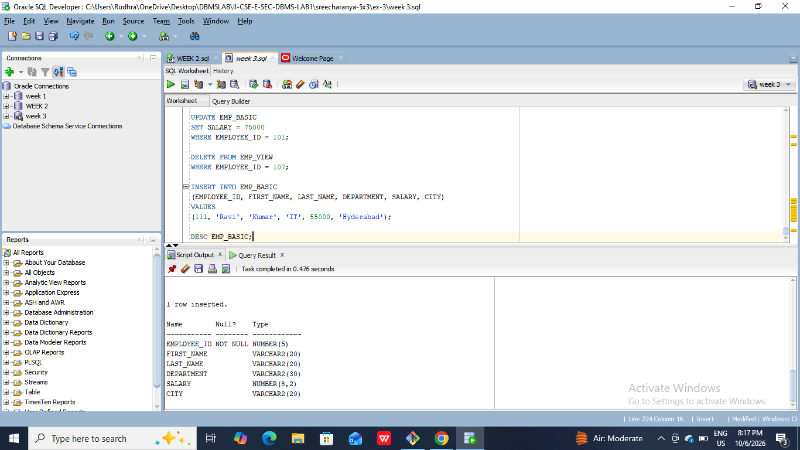
#Q18.Write an SQL query to display employees from the HIGH_SALARY view whose salary is greater than ₹70,000.
```
SELECT *
FROM HIGH_SALARY
WHERE SALARY > 70000;
```
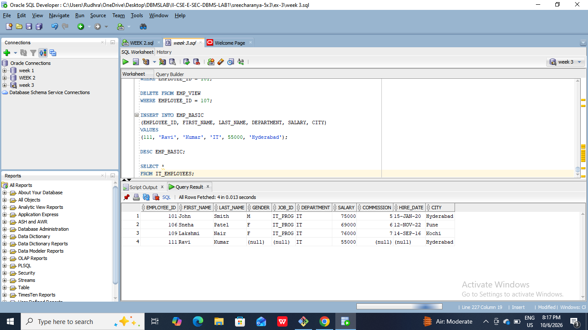
#Q19.Write an SQL query to display all female employees from the FEMALE_EMP view.
```
SELECT *
FROM FEMALE_EMP;
```
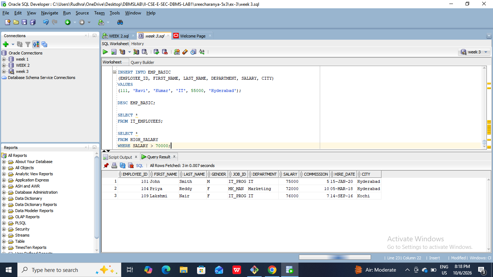
#Q20.Write an SQL query to display the names and salaries of employees from the HYDERABAD_EMP view.
```
SELECT FIRST_NAME, SALARY
FROM HYDERABAD_EMP;
```
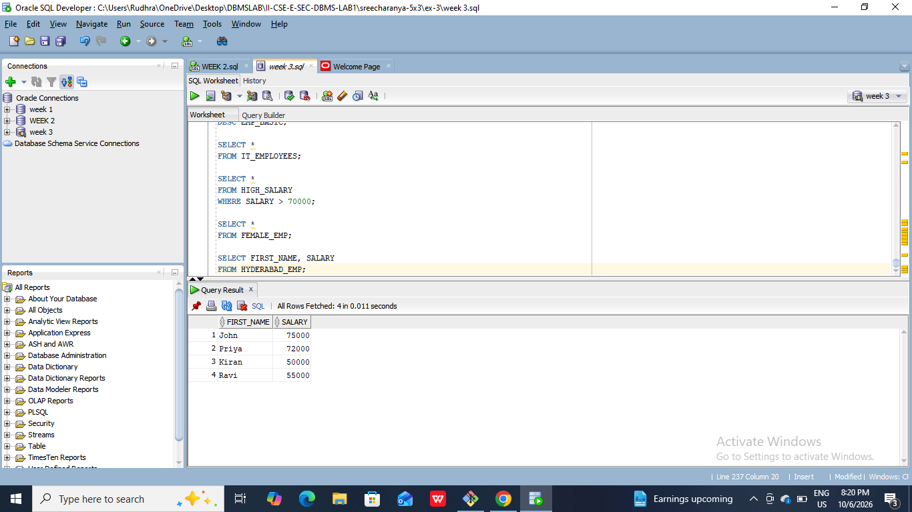
#Q21.Write an SQL query to drop the EMP_VIEW.
```
DROP VIEW EMP_VIEW;
```

#Q22.Write an SQL query to drop the HIGH_SALARY view.
```
DROP VIEW HIGH_SALARY;
```
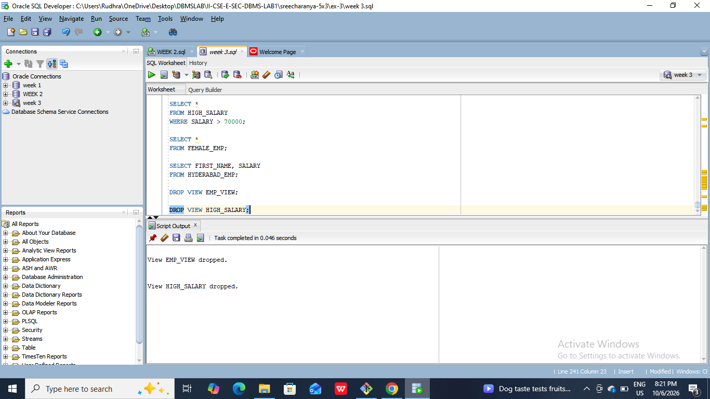
#Q23.Write an SQL query to drop the EMP_BASIC view.
```
DROP VIEW EMP_BASIC;
```
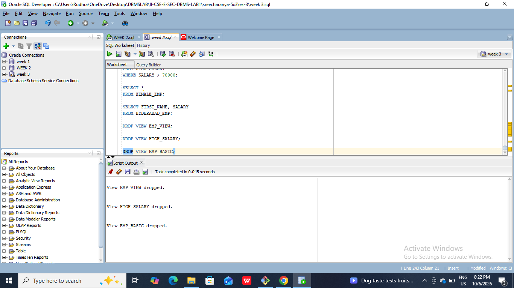
#Q24.Write an SQL query to create a view named HR_EMPLOYEES that displays employees working in the HR department.
```
CREATE VIEW HR_EMPLOYEES AS
SELECT *
FROM EMPLOYEE
WHERE DEPARTMENT = 'HR';
```

#Q25.Write an SQL query to create a view named MARKETING_EMP that displays the Employee ID, First Name, Department, and Salary of employees working in the Marketing department.
```
CREATE VIEW MARKETING_EMP AS
SELECT EMPLOYEE_ID, FIRST_NAME, DEPARTMENT, SALARY
FROM EMPLOYEE
WHERE DEPARTMENT = 'Marketing';
```
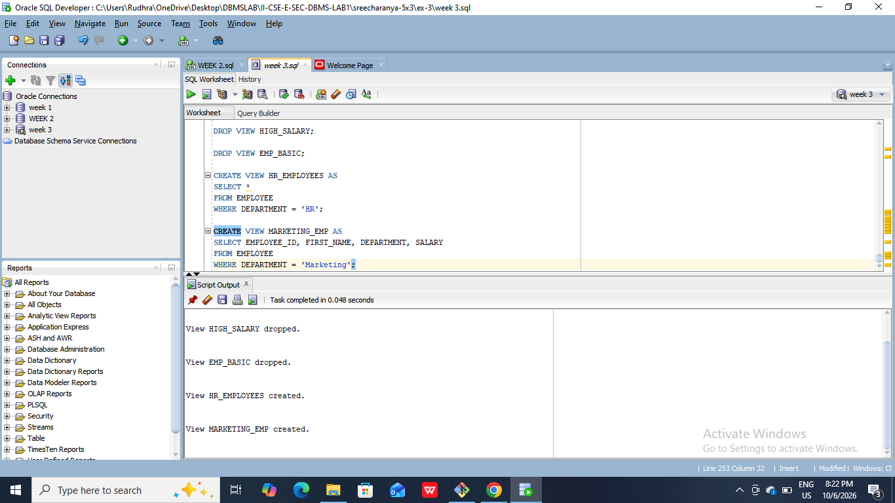
#Q26.Write an SQL query to create a view named TOP_EARNERS that displays employees earning more than ₹70,000.
```
CREATE VIEW TOP_EARNERS AS
SELECT *
FROM EMPLOYEE
WHERE SALARY > 70000;
```
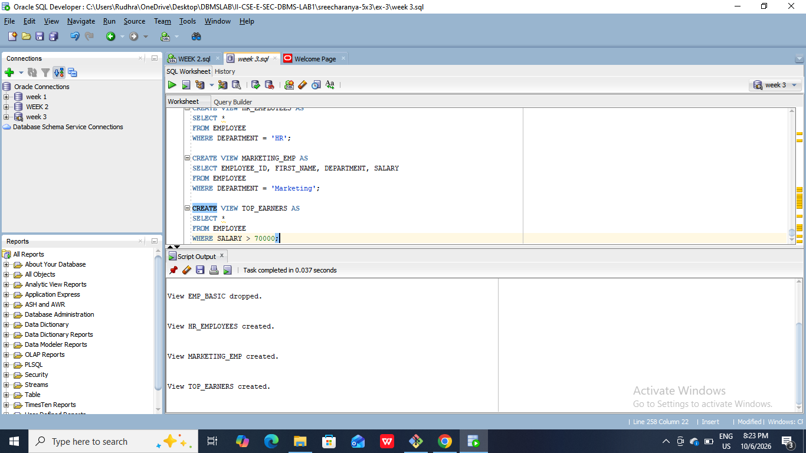
#Q27.Write an SQL query to create a view named EMP_CITY that displays the Employee ID, First Name, Last Name, and City of all employees.
```
CREATE VIEW EMP_CITY AS
SELECT EMPLOYEE_ID, FIRST_NAME, LAST_NAME, CITY
FROM EMPLOYEE;
```
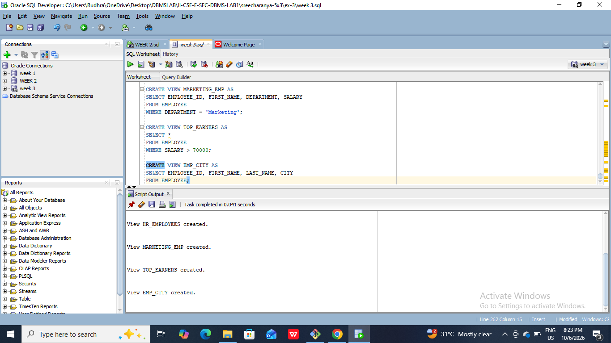
