##Write SQL queries to perform JOIN OPERATIONS (i.e. CONDITIONAL JOIN,EQUI JOIN, LEFT OUTER JOIN, RIGHT OUTER JOIN, FULL OUTER JOIN).
#1. Create a dept table having dno, dname as columns.
```
CREATE TABLE DEPT
(
    DNO NUMBER PRIMARY KEY,
    DNAME VARCHAR2(30) NOT NULL
);
```
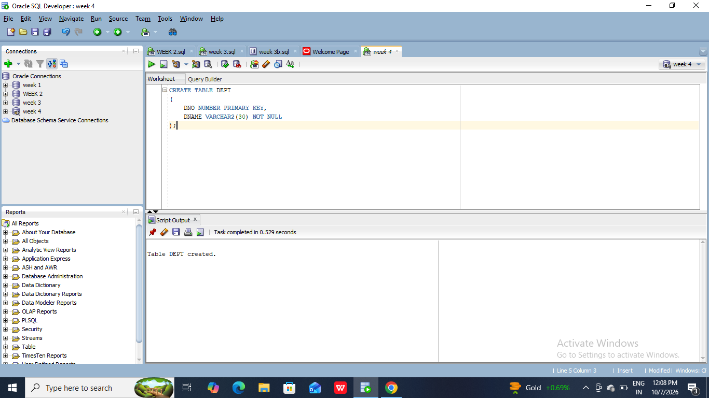
#2. Apply 'Primary Key Constraint' for dno and NOT NULL Constraint for dname to dept table Student and Dept.
```
INSERT INTO DEPT VALUES (10, 'CSE');
INSERT INTO DEPT VALUES (20, 'ME');
INSERT INTO DEPT VALUES (30, 'CE');
INSERT INTO DEPT VALUES (40, 'EEE');
INSERT INTO DEPT VALUES (50, 'ECE');
INSERT INTO DEPT VALUES (60, 'CSM');
INSERT INTO DEPT VALUES (70, 'CSD');

COMMIT;
```
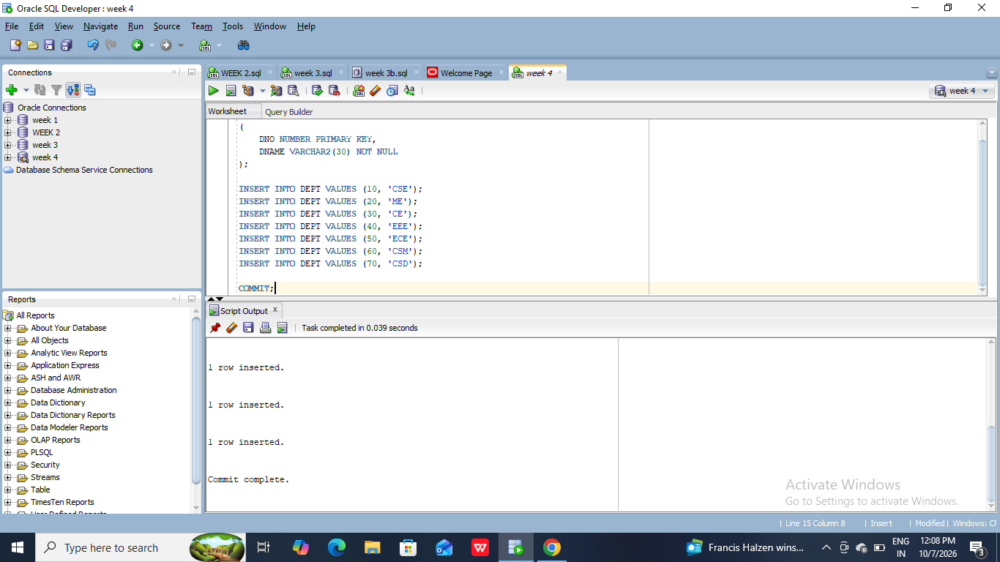
#3. Create a student table having sid, sname, and did as columns.
```
CREATE TABLE STUDENT
(
    SID NUMBER PRIMARY KEY,
    SNAME VARCHAR2(30) NOT NULL,
    DID NUMBER,
    CONSTRAINT FK_STUDENT_DEPT
        FOREIGN KEY (DID) REFERENCES DEPT(DNO)
);
```
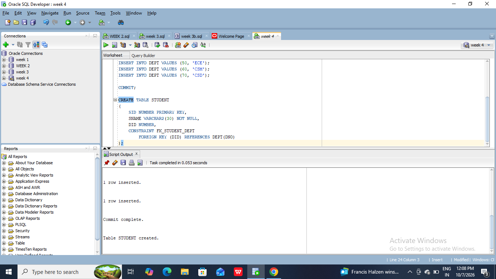
#4. Apply Primary Key Constraint to sid, NOT NULL Constraint to Sname and Foreign Key Constraint to did refers to dept table
```
INSERT INTO STUDENT VALUES (101, 'Rahul', 10);
INSERT INTO STUDENT VALUES (102, 'Sneha', 20);
INSERT INTO STUDENT VALUES (103, 'Arjun', 30);
INSERT INTO STUDENT VALUES (104, 'Kiran', 40);
INSERT INTO STUDENT VALUES (105, 'Priya', 50);
INSERT INTO STUDENT VALUES (106, 'Nikhil', 60);
INSERT INTO STUDENT VALUES (107, 'Anjali', 10);
INSERT INTO STUDENT VALUES (108, 'Ravi', 20);
INSERT INTO STUDENT VALUES (109, 'Divya', 30);
INSERT INTO STUDENT VALUES (110, 'Vijay', 40);

COMMIT;
```
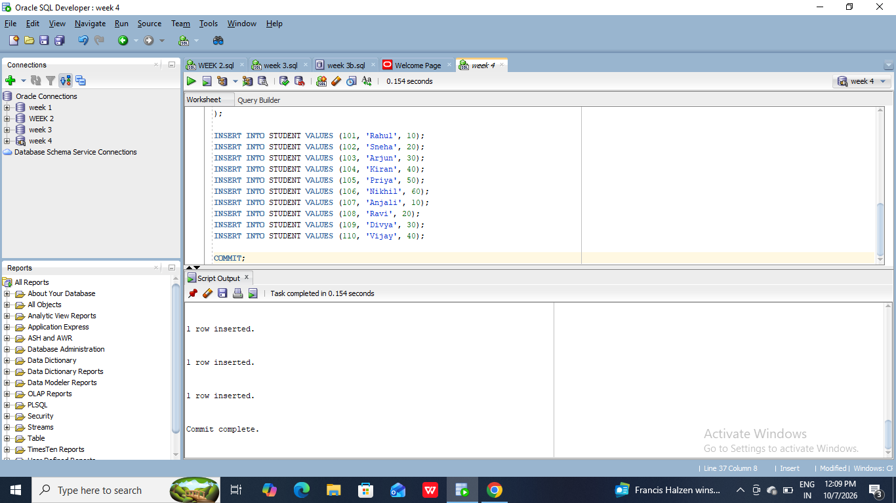
#5. Insert all department details like cse, me, ce, eee, ece, csm, csd in the dept table.
```
SELECT S.SID, S.SNAME, D.DNO, D.DNAME
FROM STUDENT S
JOIN DEPT D
ON S.DID = D.DNO;
```

#6. Insert at least 10 rows in the student table, take values of your own
```
SELECT S.SID,
       S.SNAME,
       D.DNAME
FROM STUDENT S
JOIN DEPT D
ON S.DID = D.DNO;
```
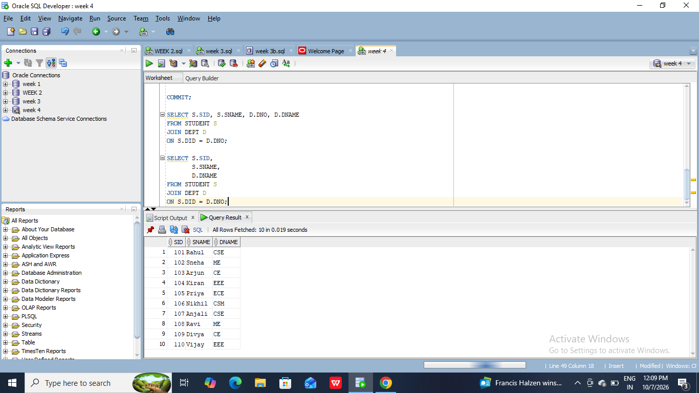
#7. Write a SQL Query to implement NATURAL JOIN between Student and Dept.
```
SELECT S.SID,
       S.SNAME,
       S.DID,
       D.DNAME
FROM STUDENT S, DEPT D
WHERE S.DID > D.DNO;
```

#8. Write a SQL Query to implement EQUI JOIN between Student and Dept.
```
LEFT OUTER NATURAL JOIN
SELECT S.SID,
       S.SNAME,
       D.DNAME
FROM STUDENT S
LEFT OUTER JOIN DEPT D
ON S.DID = D.DNO;
```
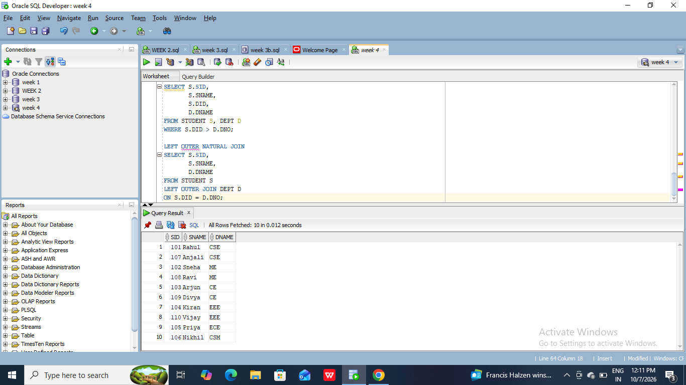
#9. Write a SQL Query to implement CONDITIONAL JOIN between Student and Dept.
```SELECT S.SID,
       S.SNAME,
       D.DNAME
FROM STUDENT S
RIGHT OUTER JOIN DEPT D
ON S.DID = D.DNO;
```

#10. Write a SQL Query to implement LEFT OUTER NATURAL JOIN between Student and Dept.
```
SELECT S.SID,
       S.SNAME,
       D.DNAME
FROM STUDENT S
FULL OUTER JOIN DEPT D
ON S.DID = D.DNO;
```
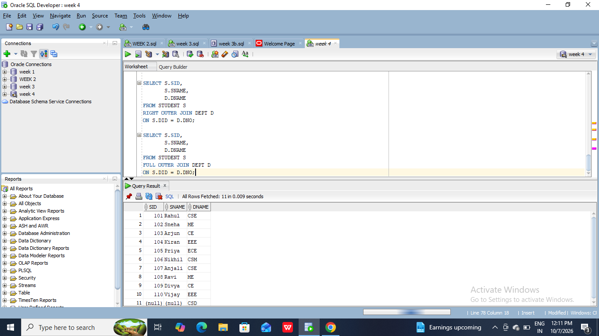
#11. Write a SQL Query to implement RIGHT OUTER NATURAL JOIN between Student and Dept.
```
SELECT S.SID,
       S.SNAME,
       D.DNAME
FROM STUDENT S
LEFT OUTER JOIN DEPT D
ON S.DID = D.DNO;
```
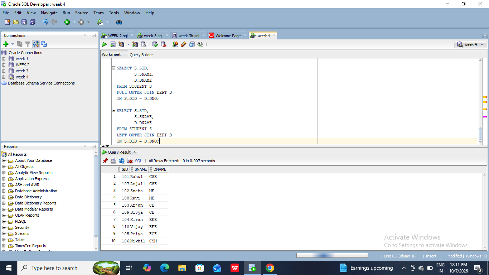
#12. Write a SQL Query to implement FULL OUTER NATURAL JOIN between Student and Dept.
```
SELECT S.SID,
       S.SNAME,
       D.DNAME
FROM STUDENT S
RIGHT OUTER JOIN DEPT D
ON S.DID = D.DNO;
```

#13. Write a SQL Query to implement LEFT OUTER EQUI JOIN between Student and Dept.
```
SELECT S.SID,
       S.SNAME,
       D.DNAME
FROM STUDENT S
FULL OUTER JOIN DEPT D
ON S.DID = D.DNO;
```
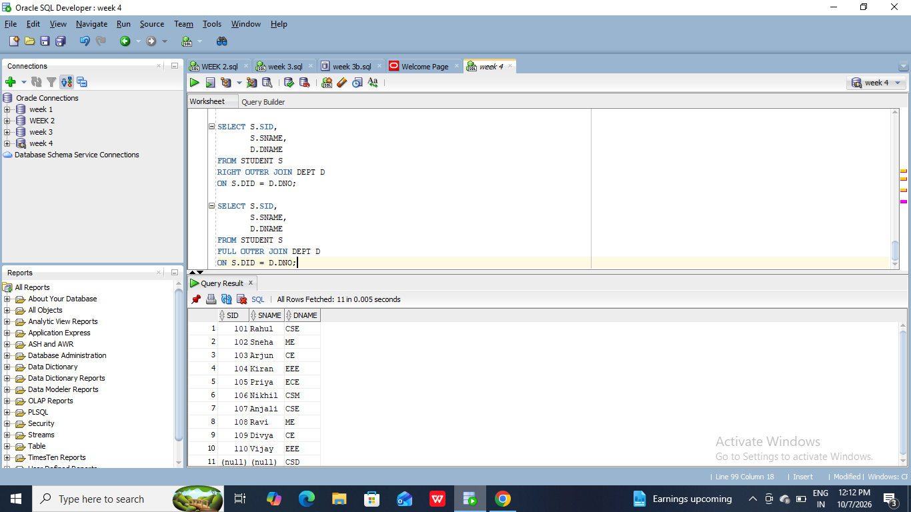
#14. Write a SQL Query to implement RIGHT OUTER EQUI JOIN between Student and Dept.
```
SELECT S.SID,
       S.SNAME,
       S.DID,
       D.DNO,
       D.DNAME
FROM STUDENT S
LEFT OUTER JOIN DEPT D
ON S.DID > D.DNO;
```
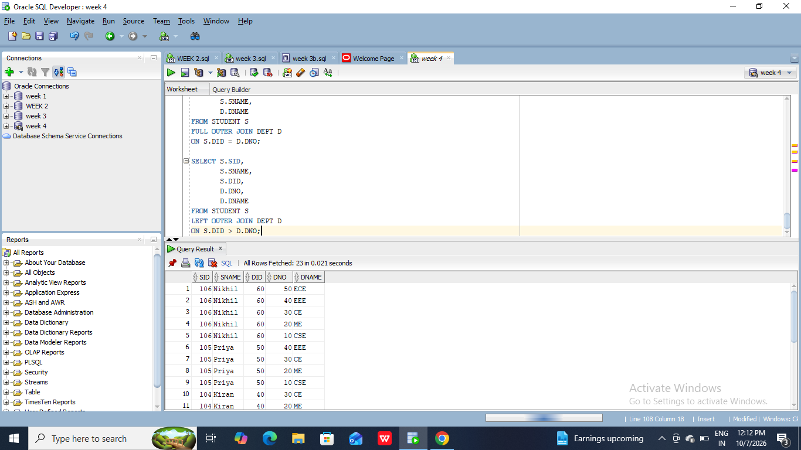
#15. Write a SQL Query to implement FULL OUTER EQUI JOIN between Student and Dept.
```
SELECT S.SID,
       S.SNAME,
       S.DID,
       D.DNO,
       D.DNAME
FROM STUDENT S
RIGHT OUTER JOIN DEPT D
ON S.DID > D.DNO;
```
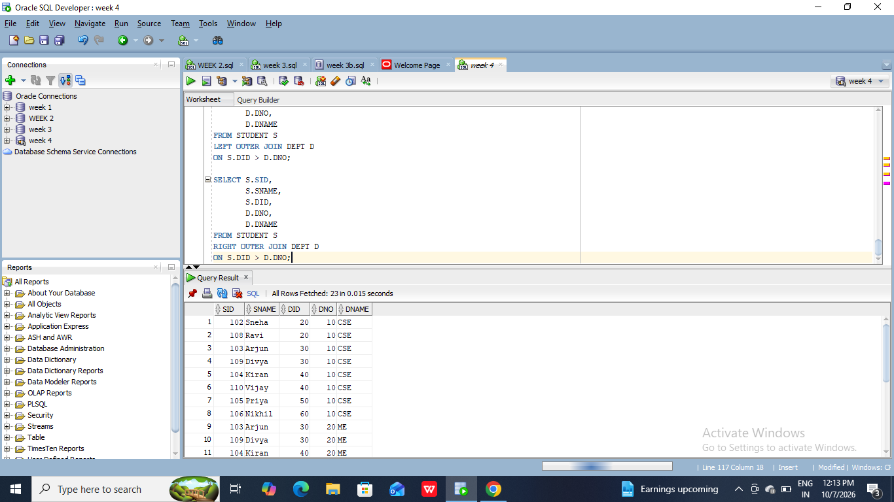
#16. Write a SQL Query to implement LEFT OUTER CONDITIONAL JOIN between Student and Dept.
```
SELECT S.SID,
       S.SNAME,
       S.DID,
       D.DNO,
       D.DNAME
FROM STUDENT S
FULL OUTER JOIN DEPT D
ON S.DID > D.DNO;
```

#17. Write a SQL Query to implement RIGHT OUTER CONDITIONAL JOIN between Student and Dept.
```
SELECT S.SID,
       S.SNAME,
       D.DNO,
       D.DNAME
FROM STUDENT S
CROSS JOIN DEPT D;
```
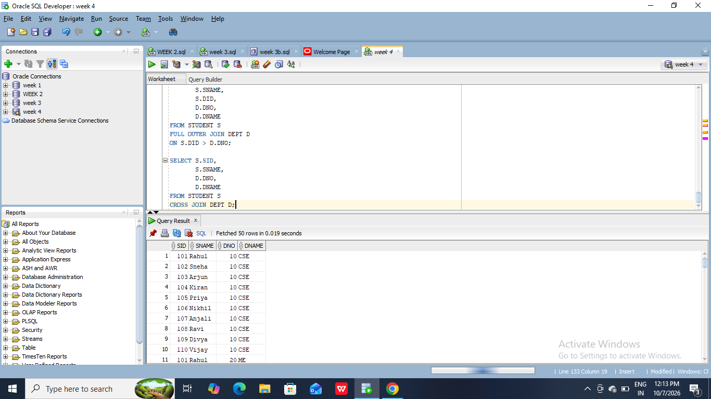
#18. Write a SQL Query to implement FULL OUTER CONDITIONAL JOIN between Student and Dept.
```
SELECT S.SID,
       S.SNAME,
       S.DID,
       D.DNO,
       D.DNAME
FROM STUDENT S
FULL OUTER JOIN DEPT D
ON S.DID > D.DNO;
```

#19.Write a SQL Query to Implement CROSS JOIN between Student and Dept.
```
SELECT S.SID,
       S.SNAME,
       D.DNO,
       D.DNAME
FROM STUDENT S
CROSS JOIN DEPT D;
```

