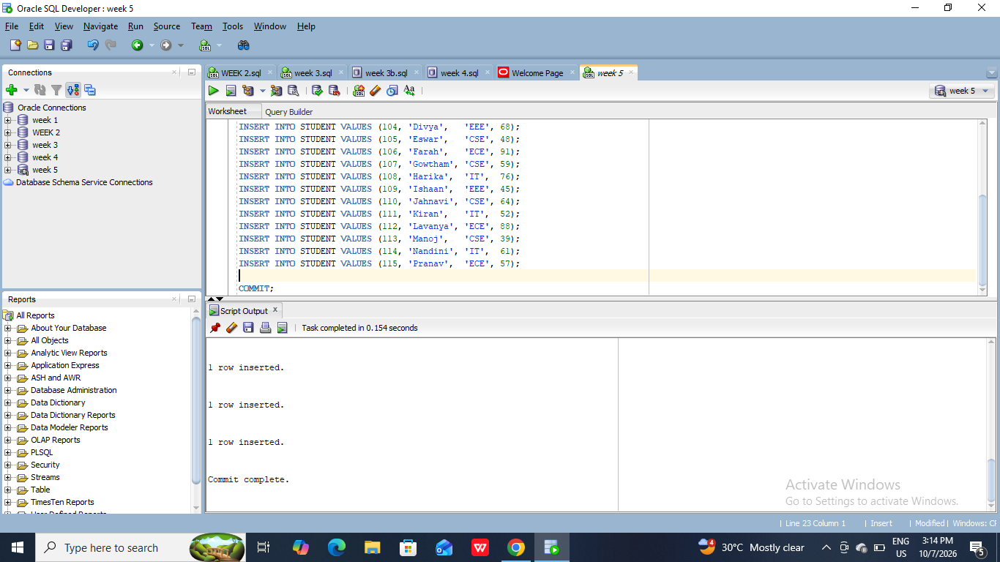
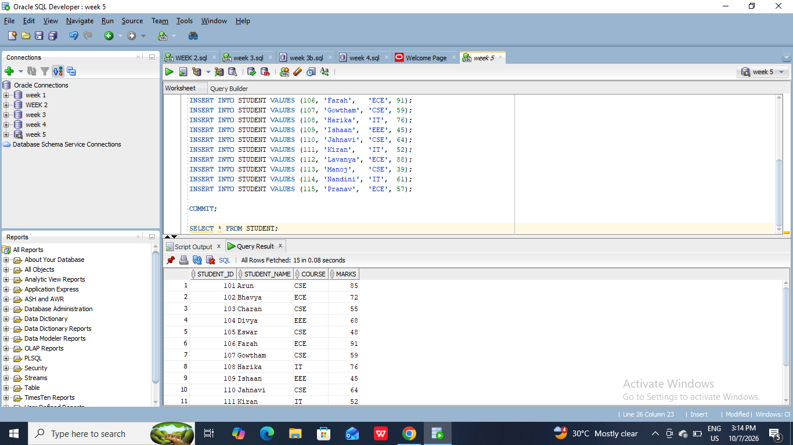
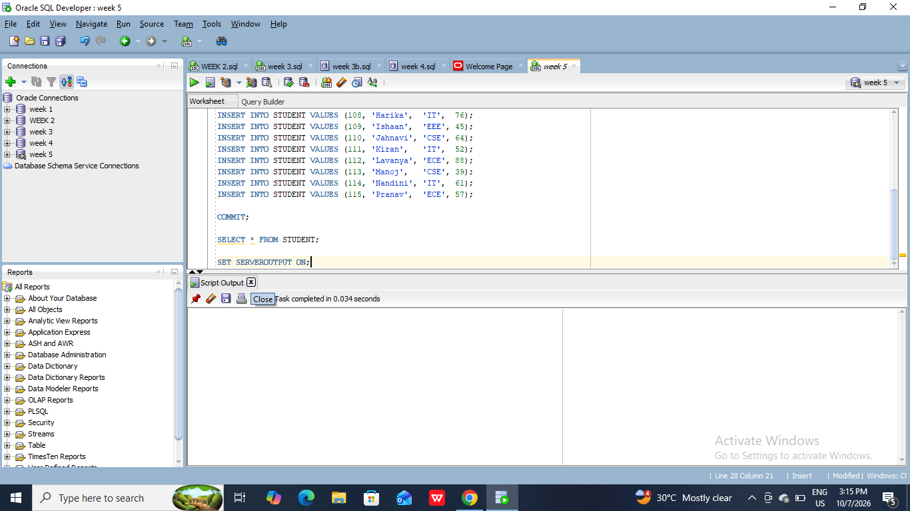
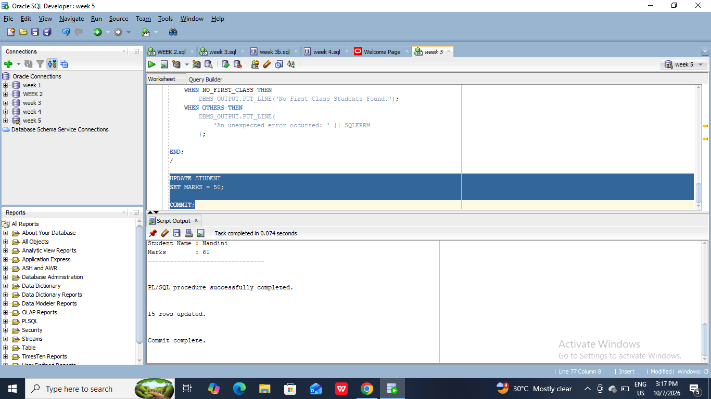
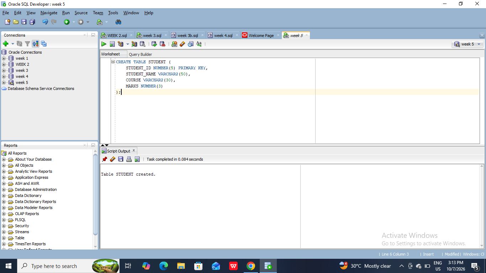
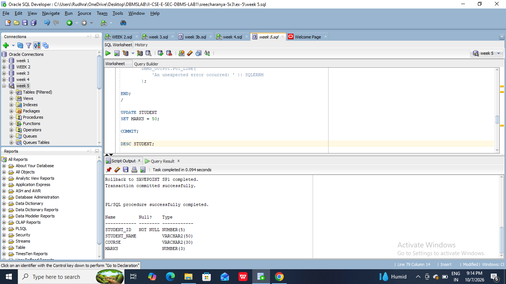
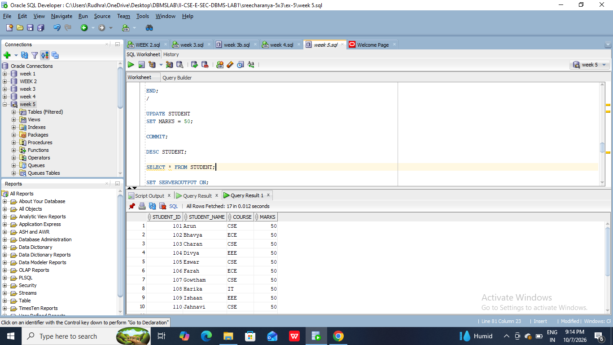
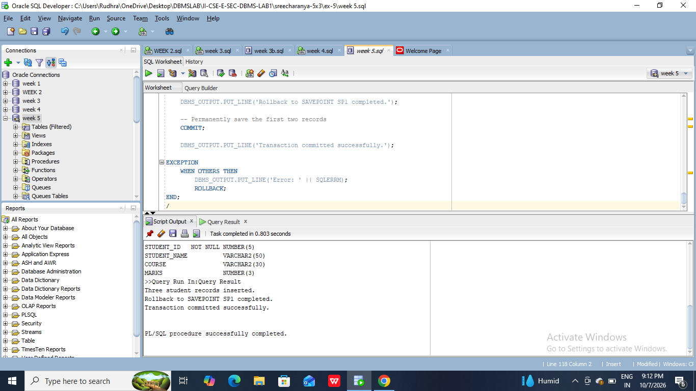

#5a) Create a simple PL/SQL program which includes declaration section, executable section and exception –Handling section (Ex. Student marks can be selected from the table and printed for those who secured first class and an exception can be raised if no records were found.
#1. Create student Database with attributes Student_id, Student_name, course and Marks and insert at least 15 row of data using insert statement.
```
CREATE TABLE STUDENT (
    STUDENT_ID NUMBER(5) PRIMARY KEY,
    STUDENT_NAME VARCHAR2(50),
    COURSE VARCHAR2(30),
    MARKS NUMBER(3)
);

INSERT INTO STUDENT VALUES (101, 'Arun',    'CSE', 85);
INSERT INTO STUDENT VALUES (102, 'Bhavya',  'ECE', 72);
INSERT INTO STUDENT VALUES (103, 'Charan',  'CSE', 55);
INSERT INTO STUDENT VALUES (104, 'Divya',   'EEE', 68);
INSERT INTO STUDENT VALUES (105, 'Eswar',   'CSE', 48);
INSERT INTO STUDENT VALUES (106, 'Farah',   'ECE', 91);
INSERT INTO STUDENT VALUES (107, 'Gowtham', 'CSE', 59);
INSERT INTO STUDENT VALUES (108, 'Harika',  'IT',  76);
INSERT INTO STUDENT VALUES (109, 'Ishaan',  'EEE', 45);
INSERT INTO STUDENT VALUES (110, 'Jahnavi', 'CSE', 64);
INSERT INTO STUDENT VALUES (111, 'Kiran',   'IT',  52);
INSERT INTO STUDENT VALUES (112, 'Lavanya', 'ECE', 88);
INSERT INTO STUDENT VALUES (113, 'Manoj',   'CSE', 39);
INSERT INTO STUDENT VALUES (114, 'Nandini', 'IT',  61);
INSERT INTO STUDENT VALUES (115, 'Pranav',  'ECE', 57);

COMMIT;
SELECT * FROM STUDENT;
SET SERVEROUTPUT ON;

DECLARE
    NO_FIRST_CLASS EXCEPTION;
    v_found BOOLEAN := FALSE;
    CURSOR student_cursor IS
        SELECT STUDENT_ID, STUDENT_NAME, MARKS
        FROM STUDENT
        WHERE MARKS >= 60;

BEGIN
    DBMS_OUTPUT.PUT_LINE('STUDENTS WHO SECURED FIRST CLASS');
    DBMS_OUTPUT.PUT_LINE('--------------------------------');
    FOR student_record IN student_cursor LOOP

        v_found := TRUE;

        DBMS_OUTPUT.PUT_LINE(
            'Student ID   : ' || student_record.STUDENT_ID
        );

        DBMS_OUTPUT.PUT_LINE(
            'Student Name : ' || student_record.STUDENT_NAME
        );

        DBMS_OUTPUT.PUT_LINE(
            'Marks        : ' || student_record.MARKS
        );

        DBMS_OUTPUT.PUT_LINE('--------------------------------');

    END LOOP;
    IF v_found = FALSE THEN
        RAISE NO_FIRST_CLASS;
    END IF;
EXCEPTION
    WHEN NO_FIRST_CLASS THEN
        DBMS_OUTPUT.PUT_LINE('No First Class Students Found.');
    WHEN OTHERS THEN
        DBMS_OUTPUT.PUT_LINE(
            'An unexpected error occurred: ' || SQLERRM
        );

END;
/
UPDATE STUDENT
SET MARKS = 50;

COMMIT;
```





#5b) Insert data into student table and use COMMIT, ROLLBACK and SAVEPOINT in PL/SQL block.
#Create Student Databases
```
CREATE TABLE STUDENT (
    STUDENT_ID NUMBER(5) PRIMARY KEY,
    STUDENT_NAME VARCHAR2(50),
    COURSE VARCHAR2(30),
    MARKS NUMBER(3)
);
DESC STUDENT;
SELECT * FROM STUDENT;
BEGIN
    -- Insert first student record
    INSERT INTO STUDENT
    VALUES (201, 'Rahul', 'CSE', 85);

    -- Insert second student record
    INSERT INTO STUDENT
    VALUES (202, 'Priya', 'ECE', 90);

    -- Create SAVEPOINT
    SAVEPOINT SP1;

    -- Insert third student record
    INSERT INTO STUDENT
    VALUES (203, 'Arun', 'IT', 78);

    DBMS_OUTPUT.PUT_LINE('Three student records inserted.');

    -- Undo only the third insertion
    ROLLBACK TO SP1;

    DBMS_OUTPUT.PUT_LINE('Rollback to SAVEPOINT SP1 completed.');

    -- Permanently save the first two records
    COMMIT;

    DBMS_OUTPUT.PUT_LINE('Transaction committed successfully.');

EXCEPTION
    WHEN OTHERS THEN
        DBMS_OUTPUT.PUT_LINE('Error: ' || SQLERRM);
        ROLLBACK;
END;
/
```




