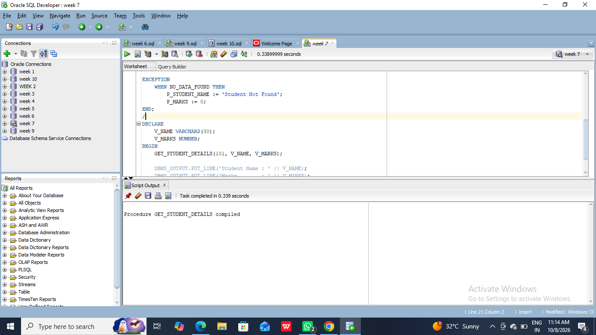
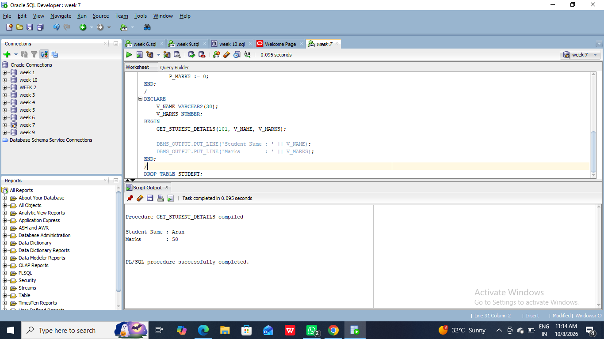
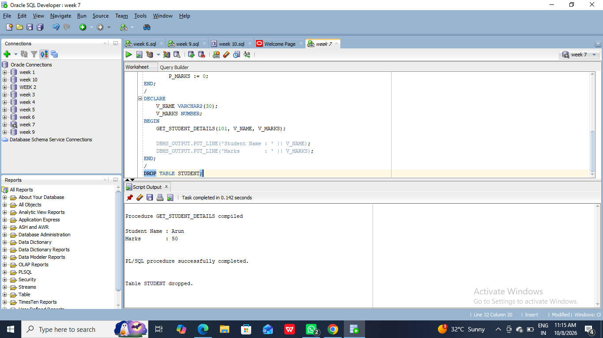
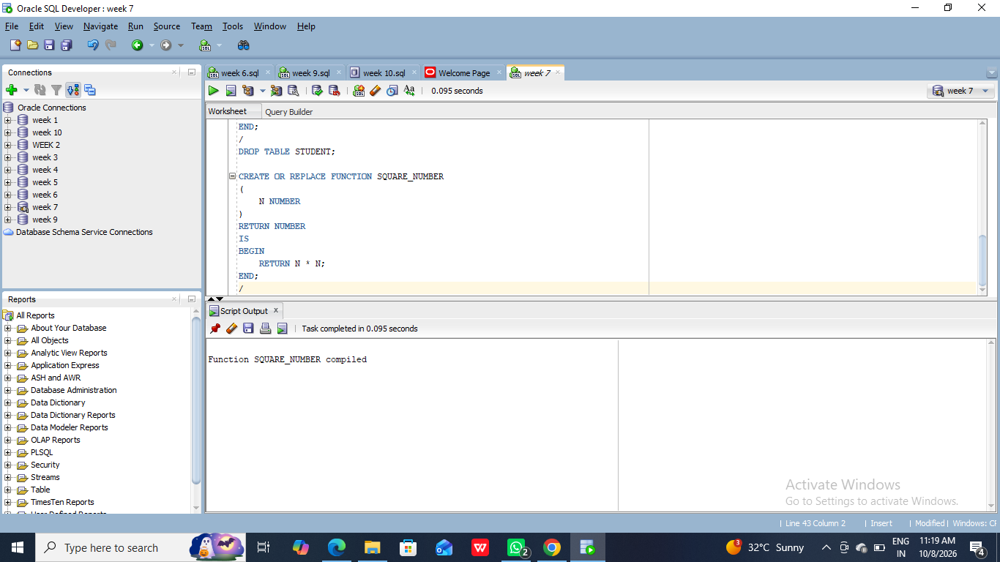
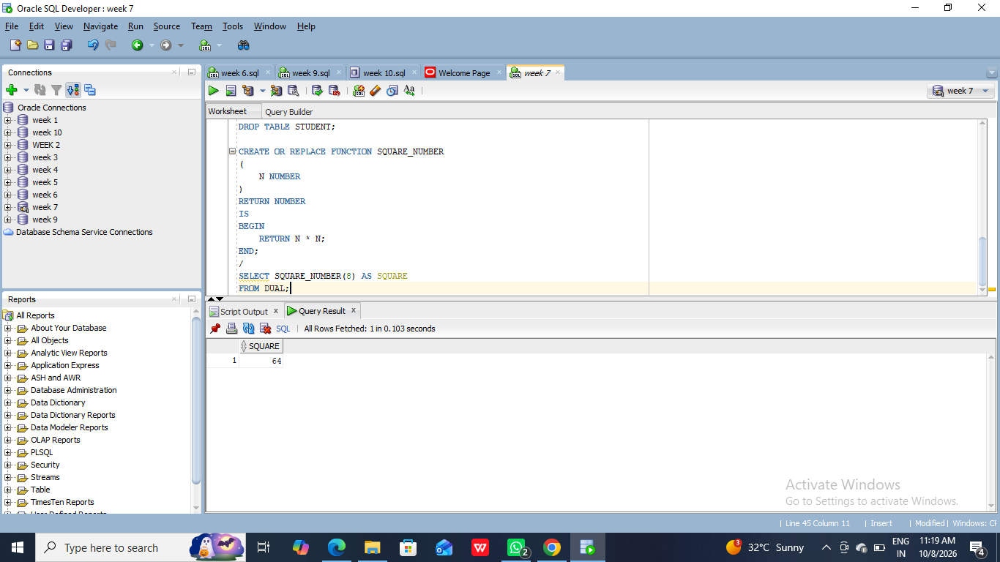
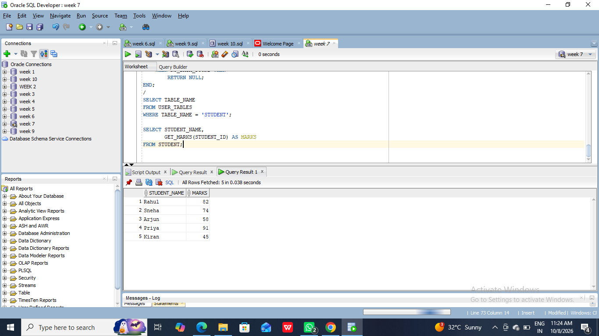
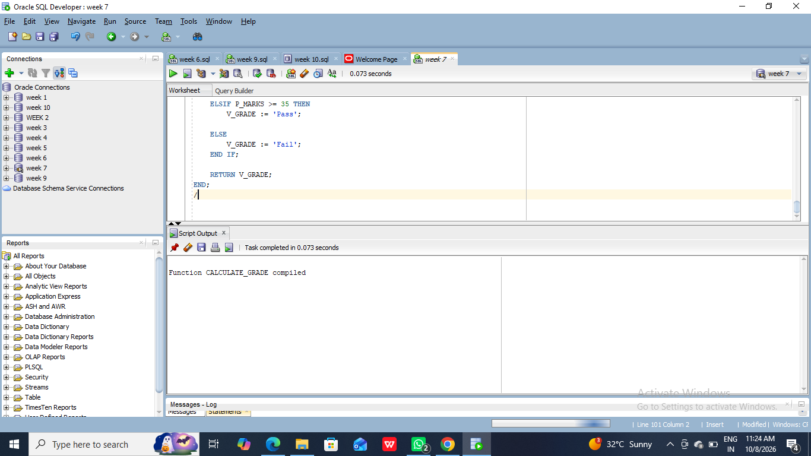
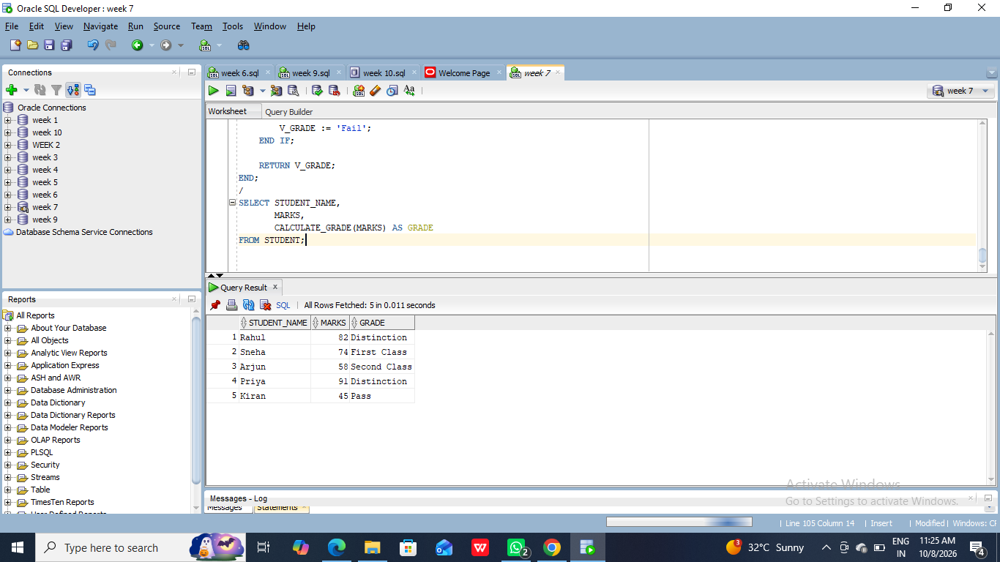

#7a) Programs development using creation of procedures, passing parameters IN and OUT of PROCEDURES.
#PL/SQL Code:
```SET SERVEROUTPUT ON;

CREATE OR REPLACE PROCEDURE GET_STUDENT_DETAILS
(
    P_STUDENT_ID IN NUMBER,
    P_STUDENT_NAME OUT VARCHAR2,
    P_MARKS OUT NUMBER
)
IS
BEGIN
    SELECT STUDENT_NAME, MARKS
    INTO P_STUDENT_NAME, P_MARKS
    FROM STUDENT
    WHERE STUDENT_ID = P_STUDENT_ID;

EXCEPTION
    WHEN NO_DATA_FOUND THEN
        P_STUDENT_NAME := 'Student Not Found';
        P_MARKS := 0;
END;
/
DECLARE
    V_NAME VARCHAR2(30);
    V_MARKS NUMBER;
BEGIN
    GET_STUDENT_DETAILS(101, V_NAME, V_MARKS);

    DBMS_OUTPUT.PUT_LINE('Student Name : ' || V_NAME);
    DBMS_OUTPUT.PUT_LINE('Marks        : ' || V_MARKS);
END;
/
DROP TABLE STUDENT;
```



#7b) Program development using creation of stored functions, invoke functions in SQL
#Program 1 : Simple Stored Function
```
CREATE OR REPLACE FUNCTION SQUARE_NUMBER
(
    N NUMBER
)
RETURN NUMBER
IS
BEGIN
    RETURN N * N;
END;
/
SELECT SQUARE_NUMBER(8) AS SQUARE
FROM DUAL;
```


#Program 2 : Stored Function Using Table Data
```
CREATE OR REPLACE FUNCTION GET_MARKS
(
    P_ID NUMBER
)
RETURN NUMBER
IS
    V_MARKS NUMBER;
BEGIN
    SELECT MARKS
    INTO V_MARKS
    FROM STUDENT
    WHERE STUDENT_ID = P_ID;

    RETURN V_MARKS;

EXCEPTION
    WHEN NO_DATA_FOUND THEN
        RETURN NULL;
END;
/
SELECT STUDENT_NAME,
       GET_MARKS(STUDENT_ID) AS MARKS
FROM STUDENT;
```


#Program 3 : Complex Stored Function
```
CREATE OR REPLACE FUNCTION CALCULATE_GRADE
(
    P_MARKS NUMBER
)
RETURN VARCHAR2
IS
    V_GRADE VARCHAR2(20);
BEGIN
    IF P_MARKS >= 75 THEN
        V_GRADE := 'Distinction';

    ELSIF P_MARKS >= 60 THEN
        V_GRADE := 'First Class';

    ELSIF P_MARKS >= 50 THEN
        V_GRADE := 'Second Class';

    ELSIF P_MARKS >= 35 THEN
        V_GRADE := 'Pass';

    ELSE
        V_GRADE := 'Fail';
    END IF;

    RETURN V_GRADE;
END;
/
SELECT STUDENT_NAME,
       MARKS,
       CALCULATE_GRADE(MARKS) AS GRADE
FROM STUDENT;
```


