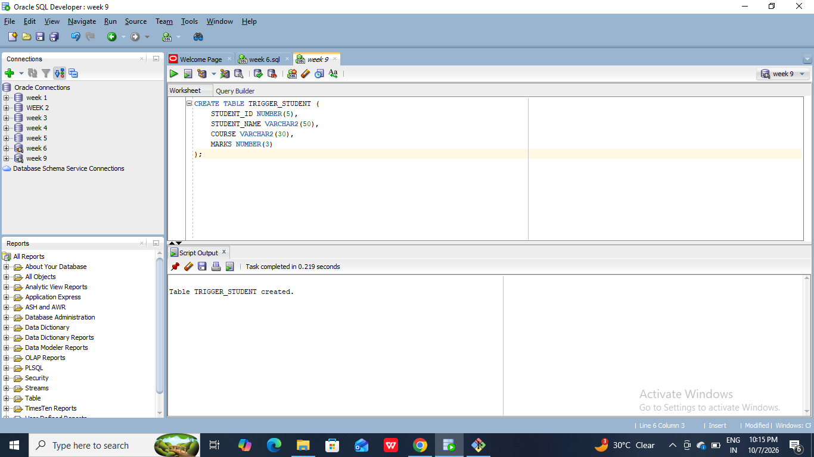
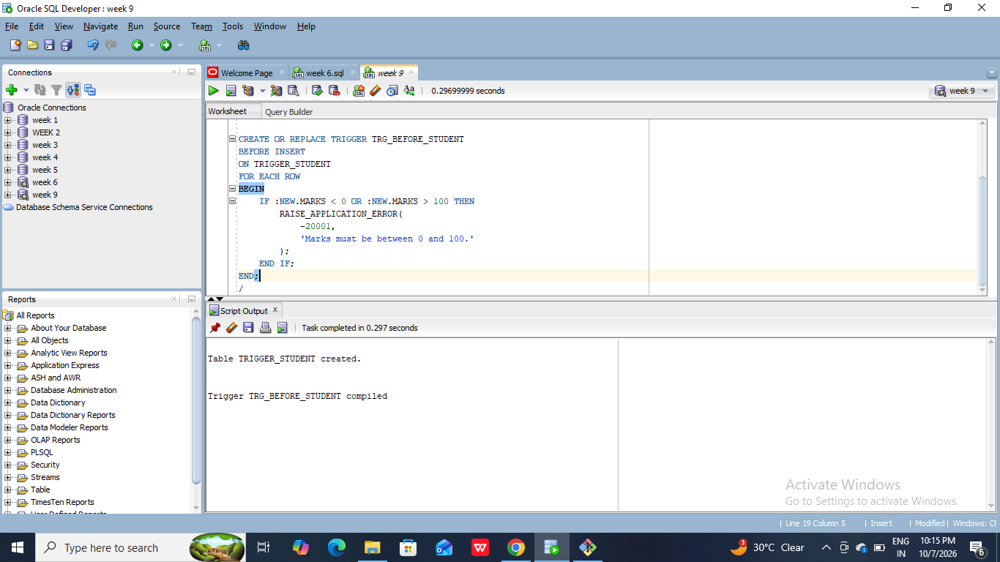
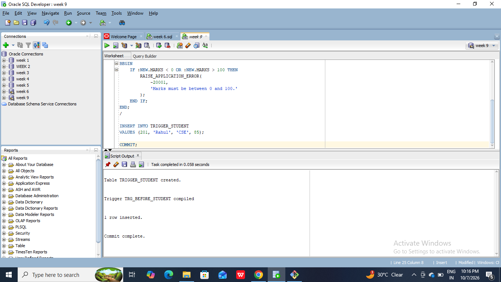
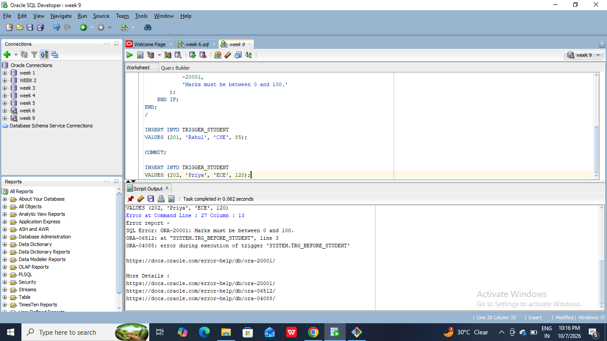
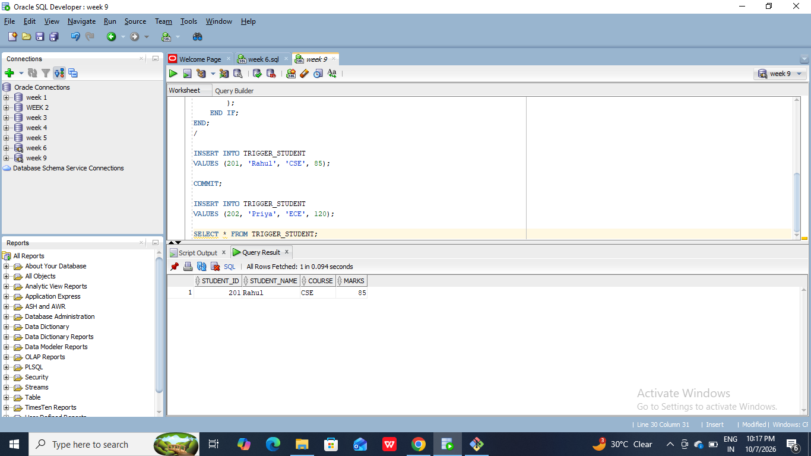

#9. Program Development Using BEFORE, AFTER, ROW, STATEMENT, and INSTEAD OF Triggers
#PL/SQL Source Code:
```
CREATE TABLE TRIGGER_STUDENT (
    STUDENT_ID NUMBER(5),
    STUDENT_NAME VARCHAR2(50),
    COURSE VARCHAR2(30),
    MARKS NUMBER(3)
);

CREATE OR REPLACE TRIGGER TRG_BEFORE_STUDENT
BEFORE INSERT
ON TRIGGER_STUDENT
FOR EACH ROW
BEGIN
    IF :NEW.MARKS < 0 OR :NEW.MARKS > 100 THEN
        RAISE_APPLICATION_ERROR(
            -20001,
            'Marks must be between 0 and 100.'
        );
    END IF;
END;
/

INSERT INTO TRIGGER_STUDENT
VALUES (201, 'Rahul', 'CSE', 85);

COMMIT;

INSERT INTO TRIGGER_STUDENT
VALUES (202, 'Priya', 'ECE', 120);

SELECT * FROM TRIGGER_STUDENT;
```





