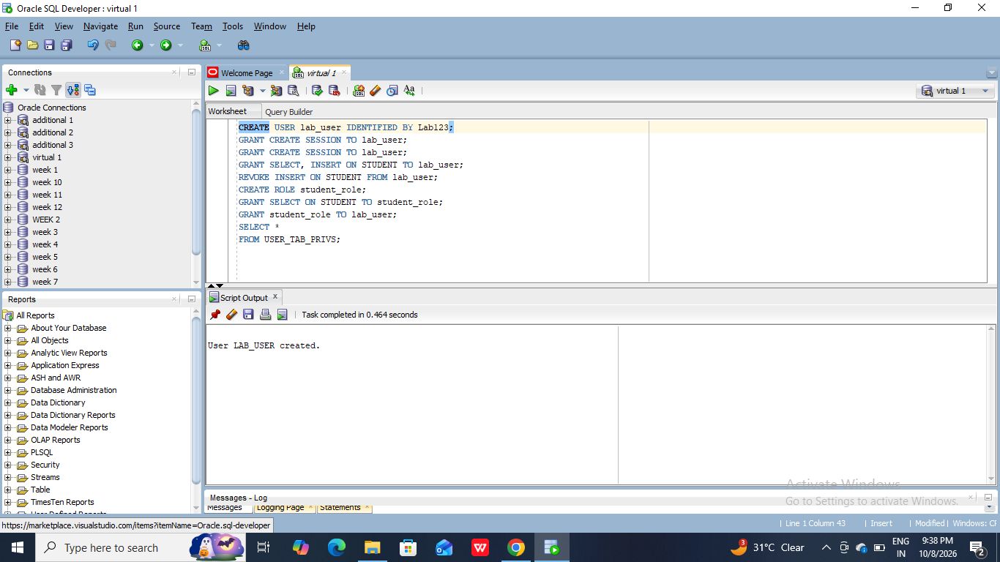
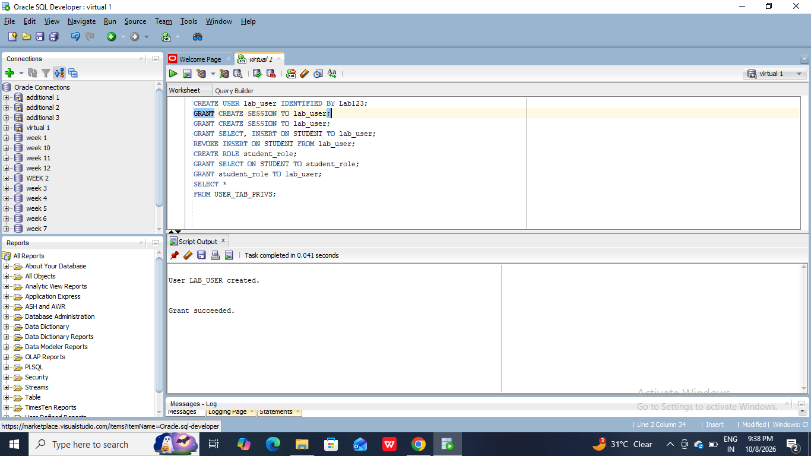
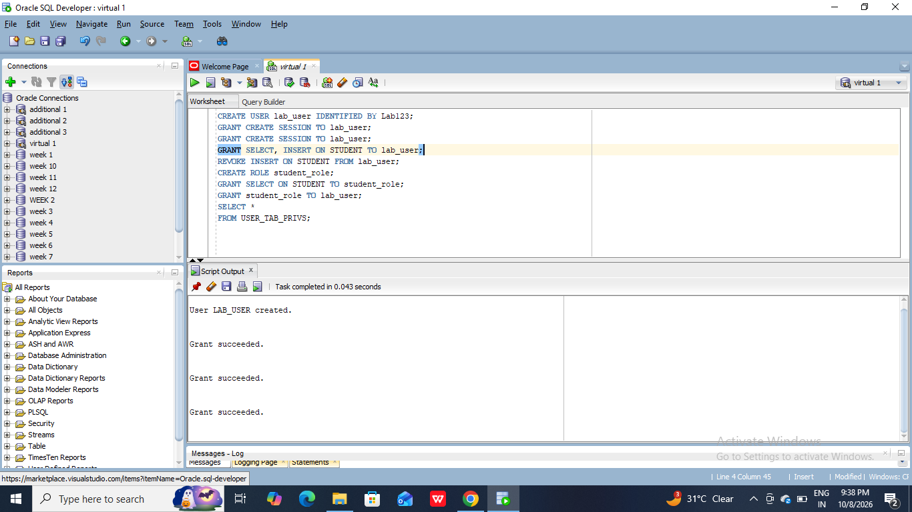
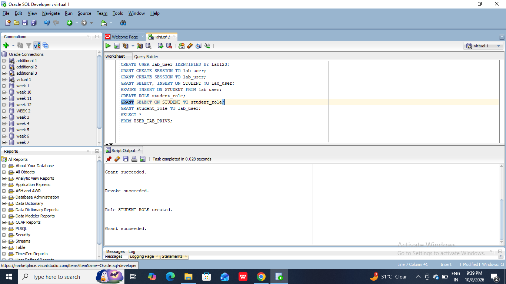

#AIM: To understand SQL injection attacks and implement appropriate countermeasures to identify and prevent SQL injection vulnerabilities in applications.
```
CREATE USER lab_user IDENTIFIED BY Lab123;
GRANT CREATE SESSION TO lab_user;
GRANT CREATE SESSION TO lab_user;
GRANT SELECT, INSERT ON STUDENT TO lab_user;
REVOKE INSERT ON STUDENT FROM lab_user;
CREATE ROLE student_role;
GRANT SELECT ON STUDENT TO student_role;
GRANT student_role TO lab_user;
SELECT * 
FROM USER_TAB_PRIVS;
```









