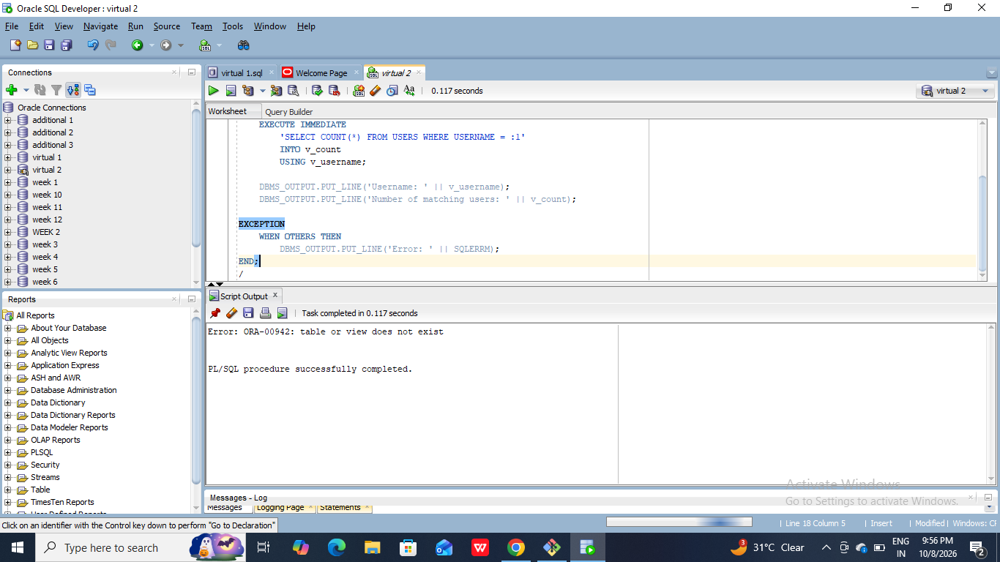

#To understand SQL injection attacks and implement appropriate countermeasures to identify and prevent SQL injection vulnerabilities in applications.
```
SET SERVEROUTPUT ON;

DECLARE
    v_username VARCHAR2(30) := 'Ravi';
    v_count    NUMBER;
BEGIN
    EXECUTE IMMEDIATE
        'SELECT COUNT(*) FROM USERS WHERE USERNAME = :1'
        INTO v_count
        USING v_username;

    DBMS_OUTPUT.PUT_LINE('Username: ' || v_username);
    DBMS_OUTPUT.PUT_LINE('Number of matching users: ' || v_count);

EXCEPTION
    WHEN OTHERS THEN
        DBMS_OUTPUT.PUT_LINE('Error: ' || SQLERRM);
END;
/
```


